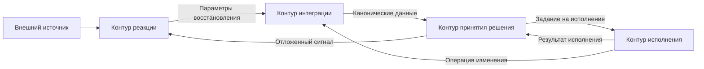

# Архитектура комплекса «Прогресс»

## 1. Назначение документа

Настоящий документ фиксирует верхнеуровневую архитектурную схему комплекса «Прогресс». Его задача — определить основные контуры, порядок их взаимодействия и направление прохождения сигнала в составе комплекса.

Подробные описания контуров вынесены в отдельные документы.

Архитектурное правило верхнего уровня: каждый контур автономен, публикует простой внешний интерфейс и не раскрывает своё внутреннее устройство другим контурам. Межконтурное взаимодействие допускается только через формализованные запросы, сигналы и результаты.

## 2. Состав основных контуров

В минимальной архитектурной схеме комплекса выделяются следующие контуры:

- контур реакции на внешние события;
- контур интеграции с внешними системами;
- контур принятия решения;
- контур исполнения.

Эти контуры образуют основной вычислительный цикл комплекса.

Помимо основных контуров, в составе комплекса действуют обеспечивающие и исследовательские контуры:

- контур методик;
- контур настроек и ресурсов;
- контур журналирования и наблюдаемости;
- контур пользовательского интерфейса;
- контур авторизации;
- очередь исполнения задач;
- контур аналитики и статистики;
- банк задач;
- контур исследований.

## 3. Логика взаимодействия контуров

Общий порядок прохождения сигнала имеет следующий вид:

1. внешний источник формирует событие или изменение состояния;
2. контур реакции регистрирует сигнал и нормализует его;
3. контур реакции передаёт параметры восстановления данных в контур интеграции;
4. контур интеграции получает внешние данные и формирует каноническое представление задачи;
5. контур принятия решения выполняет атрибуцию задачи и определяет дальнейший режим обработки;
6. после согласования решения формируется задание на выполнение;
7. контур исполнения проводит задачу через требуемый вычислительный каскад;
8. результат выполнения возвращается в контур принятия решения и при необходимости транслируется во внешние действия через контур интеграции;
9. при необходимости формируется повторный или отложенный сигнал для нового цикла обработки.

## 4. Схема взаимодействия

На данной схеме показан только основной цикл прохождения сигнала между ключевыми контурами. Обеспечивающие и исследовательские контуры не включены в диаграмму и рассматриваются отдельно в текстовом описании.

## 5. Роль контуров

### 5.1 Контур реакции на внешние события

Назначение контура — приём внешних сигналов, их нормализация и передача в дальнейшую обработку.

Контур должен быть достаточным для автономной работы комплекса, но вся система обязана оставаться работоспособной и без него, если сигналы подаются вручную через CLI или внутренние команды диагностики.

Подробное описание: `docs/contours/reactivity/README.md`

### 5.2 Контур интеграции с внешними системами

Назначение контура — предоставление унифицированного интерфейса к внешним системам хранения задач, кода, артефактов и коммуникаций.

Подробное описание: `docs/contours/integration/README.md`

### 5.3 Контур принятия решения

Назначение контура — восстановление текущей стадии обработки по внешним данным, выбор сценария и формирование задания на выполнение.

Подробное описание: `docs/contours/decision/README.md`

### 5.4 Контур исполнения

Назначение контура — выполнение формализованной задачи в изолированной и воспроизводимой вычислительной среде.

Контур исполнения получает структурированную задачу, желаемый профиль или пресет исполнения и требования к структуре ответа. Внутри он самостоятельно выбирает исполнительный движок, модель, рабочее место и технические шаги запуска.

Подробное описание: `docs/contours/execution/README.md`

### 5.5 Обеспечивающие и исследовательские контуры

Контур методик хранит переносимые маршруты, действия и инструкции.

Контур настроек и ресурсов описывает доступные интеграции, окружения исполнения, инструменты исполнения, ресурсы исполнения, привязки ресурсов и переопределения.

Контур журналирования и наблюдаемости фиксирует события, решения, запуски, операции, результаты и отказные состояния.

Контур пользовательского интерфейса предоставляет эксплуатационный доступ к задачам, маршрутам, запускам, настройкам и диагностике.

Контур авторизации проверяет доступ к сведениям и операциям комплекса.

Очередь исполнения задач управляет отложенными и приоритизированными заданиями, по которым уже принято решение о выполнении.

Контур аналитики и статистики рассчитывает показатели работы комплекса.

Банк задач хранит проверочные наборы для исследований, отладки и сравнительных прогонов.

Контур исследований проверяет гипотезы об улучшении методик, маршрутов, профилей и настроек.

Подробные описания:

- `docs/contours/CONTRACTS.md`
- `docs/contours/methodology/README.md`
- `docs/contours/settings-resources/README.md`
- `docs/contours/observability/README.md`
- `docs/contours/user-interface/README.md`
- `docs/contours/authorization/README.md`
- `docs/contours/execution-queue/README.md`
- `docs/contours/analytics/README.md`
- `docs/contours/task-bank/README.md`
- `docs/contours/research/README.md`

## 6. Общий CLI и наблюдаемость

Поверх контуров действует общий CLI комплекса. Его обязанности:

1. запускать полный прикладной маршрут, имитируя внешний запрос в систему;
2. запускать отдельные функции контуров и модулей изолированно для диагностики;
3. поддерживать единые режимы `dry-run` и `--explain`;
4. обеспечивать единообразное журналирование старта контура, модуля и ключевых параметров запуска.

`dry-run` должен блокировать внешние побочные действия, например отправку комментариев, изменение статусов, создание запросов на слияние и иные интеграционные операции записи.

`--explain` должен раскрывать не внутреннюю реализацию модулей, а причины выбора: сработавшие правила, использованные источники данных, выбранный профиль, ограничения и условия перехода.

## 7. Ближайшие архитектурные задачи

На ближайшем этапе требуется:

1. формализовать модель сигнала и задачи;
2. определить формат конфигурации комплекса;
3. описать интерфейсы обмена между контурами;
4. определить правила работы с проектным состоянием и оперативным контекстом;
5. зафиксировать минимальный режим верификации;
6. определить базовый журнал прохождения сигнала по контурам.

В прикладном приоритете первым должен быть проведён рабочий маршрут контура принятия решения по задаче разработки: запуск по номеру задачи, передача в кодирование, открытие запроса на слияние, ревизия, доработка, повторная ревизия и слияние.
