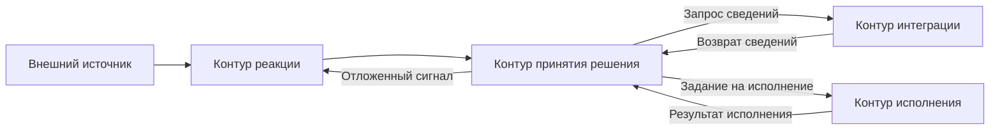

# Архитектура комплекса «Прогресс»

## 1. Назначение документа

Настоящий документ фиксирует верхнеуровневую архитектурную схему комплекса «Прогресс». Его задача — определить основные контуры, порядок их взаимодействия и направление прохождения сигнала в составе комплекса.

Подробные описания контуров вынесены в отдельные документы.

Архитектурное правило верхнего уровня: каждый контур автономен, публикует простой внешний интерфейс и не раскрывает своё внутреннее устройство другим контурам. Межконтурное взаимодействие допускается только через формализованные запросы, сигналы и результаты.

## 2. Состав основных контуров

В минимальной архитектурной схеме комплекса выделяются следующие контуры:

- контур реакции на внешние события;
- контур интеграции с внешними системами;
- контур принятия решения;
- контур исполнения.

Эти контуры образуют основной вычислительный цикл комплекса.

Помимо основных контуров, в составе комплекса действуют поддерживающие подсистемы:

- подсистема оперативного контекста;
- подсистема проектного состояния;
- контекстный архив;
- подсистема конфигурации;
- подсистема верификации;
- подсистема журналирования и наблюдаемости.

## 3. Логика взаимодействия контуров

Общий порядок прохождения сигнала имеет следующий вид:

1. внешний источник формирует событие или изменение состояния;
2. контур реакции регистрирует сигнал и нормализует его;
3. контур принятия решения выполняет атрибуцию задачи и определяет дальнейший режим обработки;
4. при необходимости контур принятия решения обращается к контуру интеграции за дополнительными сведениями;
5. после согласования решения формируется задание на исполнение;
6. контур исполнения проводит задачу через требуемый вычислительный каскад;
7. результат исполнения возвращается в контур принятия решения, фиксируется в проектном состоянии и при необходимости транслируется во внешние действия;
8. при необходимости формируется повторный или отложенный сигнал для нового цикла обработки.

## 4. Схема взаимодействия

На данной схеме показан только основной цикл прохождения сигнала между ключевыми контурами. Поддерживающие подсистемы, включая конфигурацию, проектное состояние, оперативный контекст, верификацию, журналирование и контекстный архив, не включены в диаграмму и рассматриваются отдельно в текстовом описании.

## 5. Роль контуров

### 5.1 Контур реакции на внешние события

Назначение контура — приём внешних сигналов, их нормализация и передача в дальнейшую обработку.

Контур должен быть достаточным для автономной работы комплекса, но вся система обязана оставаться работоспособной и без него, если сигналы подаются вручную через CLI или внутренние команды диагностики.

Подробное описание: `docs/contours/reactivity/README.md`

### 5.2 Контур интеграции с внешними системами

Назначение контура — предоставление унифицированного интерфейса к внешним системам хранения задач, кода, артефактов и коммуникаций.

Подробное описание: `docs/contours/integration/README.md`

### 5.3 Контур принятия решения

Назначение контура — восстановление текущей стадии обработки по внешним данным, выбор сценария и формирование задания на исполнение.

Подробное описание: `docs/contours/decision/README.md`

### 5.4 Контур исполнения

Назначение контура — выполнение формализованной задачи в изолированной и воспроизводимой вычислительной среде.

Контур исполнения получает структурированную задачу, желаемый профиль или пресет исполнения и требования к структуре ответа. Внутри он самостоятельно выбирает исполнительный движок, модель, рабочее место и технические шаги запуска.

Подробное описание: `docs/contours/execution/README.md`

## 6. Общий CLI и наблюдаемость

Поверх контуров действует общий CLI комплекса. Его обязанности:

1. запускать полный прикладной маршрут, имитируя внешний запрос в систему;
2. запускать отдельные функции контуров и модулей изолированно для диагностики;
3. поддерживать единые режимы `dry-run` и `--explain`;
4. обеспечивать единообразное журналирование старта контура, модуля и ключевых параметров запуска.

`dry-run` должен блокировать внешние побочные действия, например отправку комментариев, изменение статусов, создание запросов на слияние и иные интеграционные операции записи.

`--explain` должен раскрывать не внутреннюю реализацию модулей, а причины выбора: сработавшие правила, использованные источники данных, выбранный профиль, ограничения и условия перехода.

## 7. Ближайшие архитектурные задачи

На ближайшем этапе требуется:

1. формализовать модель сигнала и задачи;
2. определить формат конфигурации комплекса;
3. описать интерфейсы обмена между контурами;
4. определить правила работы с проектным состоянием и оперативным контекстом;
5. зафиксировать минимальный режим верификации;
6. определить базовый журнал прохождения сигнала по контурам.

В прикладном приоритете первым должен быть проведён рабочий маршрут контура принятия решения по задаче разработки: запуск по номеру задачи, передача в кодирование, открытие запроса на слияние, ревизия, доработка, повторная ревизия и слияние.
