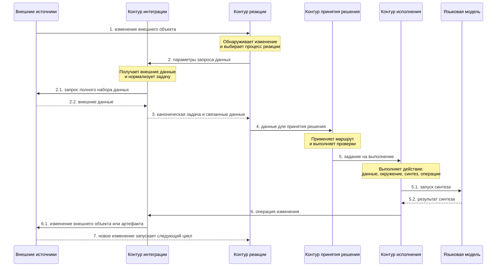

# Целевая архитектура комплекса «Прогресс»

## Назначение документа

Документ вводит в целевую модель комплекса «Прогресс»: назначение, принцип работы, ключевые контуры и базовые понятия. Детальные контракты контуров описываются отдельно.

## Назначение комплекса

Комплекс «Прогресс» предназначен для проведения инженерных задач через управляемые маршруты обработки. Комплекс реагирует на внешние изменения, восстанавливает каноническое представление задачи, принимает решение о следующем шаге, выполняет действие и фиксирует диагностические сведения о запуске.

Комплекс не рассматривается как диалоговая система. Языковая модель является одним из исполнительных модулей, который применяется внутри заданных границ маршрута обработки.

Ключевая цель комплекса — отделить повторяемые инженерные правила от недетерминированного синтеза и сделать прохождение задачи воспроизводимым, наблюдаемым и переносимым между проектами.

## Общие идеи

Комплекс строится из независимых и относительно простых контуров. Каждый контур решает понятную локальную задачу, имеет собственную ответственность и взаимодействует с другими контурами через формализованные данные. Вместе эти контуры дают эффект, который сложно получить от одного универсального исполнительного механизма.

Комплекс должен сосуществовать с людьми в той же инженерной среде. Он работает с задачами, запросами на слияние, комментариями, ветками, статусами и другими внешними объектами, понятными инженерам. Поэтому автоматизация может покрывать отдельные участки процесса, не требуя немедленного исключения человека из всего рабочего цикла.

Важная практическая цель — воспроизводить отдельные аспекты инженерной работы: обнаружить, что появилась работа; собрать данные; понять следующий шаг; подготовить окружение; выполнить изменение; оставить результат во внешней системе; дождаться следующего изменения.

## Четыре основных контура обработки

Для непосредственной обработки задач в комплексе выделены четыре основных контура.

Контур реакции на внешние события отвечает за автономный вход в обработку. Его задача — узнать об изменении во внешней среде, выбрать подходящий процесс реакции и передать параметры, по которым можно получить полные данные.

Контур интеграции отвечает за стандартную работу с внешними источниками. Его задача — дать другим контурам единый способ взаимодействия с внешними объектами: задачами, запросами на слияние, репозиториями, обсуждениями, сообщениями и другими артефактами. Для этого контур публикует внутренний интерфейс и приводит внешние объекты к каноническим структурам комплекса.

Контур принятия решения отвечает за выбор следующего шага. Его задача — определить, что сейчас нужно сделать с задачей, чтобы приблизить её к ожидаемому результату. Контур работает с канонической задачей и связанными данными, применяет маршрут обработки, выполняет проверки и формирует задание на выполнение.

Контур исполнения отвечает за выполнение выбранного действия. Его задача — выполнить действие, которое продвинет задачу к результату или хотя бы выполнит диагностируемую попытку такого продвижения. Контур готовит данные и окружение, запускает языковую модель при необходимости, выполняет операции действия и приводит результат к изменению внешнего объекта или связанного артефакта.

Эти контуры образуют базовый цикл: внешний источник сообщает о новом состоянии, комплекс восстанавливает данные, выбирает шаг, выполняет действие и оставляет результат во внешней среде.

## Базовый цикл обработки

Общий цикл обработки имеет следующий вид:

1. во внешнем источнике происходит изменение;
2. контур реакции на внешние события узнаёт об изменении;
3. контур реакции передаёт в контур интеграции параметры запроса данных;
4. контур интеграции запрашивает внешние источники и приводит полученные данные к канонической структуре задачи;
5. контур интеграции возвращает каноническую задачу и связанные данные контуру реакции;
6. контур реакции передаёт данные в контур принятия решения;
7. контур принятия решения применяет маршрут обработки и выполняет ряд проверок;
8. по результатам проверок контур принятия решения формирует задание на выполнение;
9. задание на выполнение поступает в контур исполнения;
10. контур исполнения выполняет действие, заданное шаблоном задания;
11. действие состоит из операций, например подготовки ветки, запуска синтеза или открытия запроса на слияние;
12. в ходе выполнения контур исполнения получает дополнительные данные, подготавливает окружение, запускает синтез и выполняет операции после работы языковой модели;
13. результат выполнения действия выражается в изменении части задачи во внешних источниках или связанных артефактах;
14. единичная обработка завершается;
15. следующая единичная обработка заново восстанавливает текущее состояние задачи из внешнего источника.

Журналирование не является отдельной стадией базового цикла. Оно сопровождает работу комплекса на каждом значимом шаге и фиксирует внешние данные, принятое решение, выбранный маршрут, проверки, задание на выполнение, операции, результат и ошибки.

## Контуры и основные сущности

### Контур реакции на внешние события

Контур реакции на внешние события обеспечивает автономность. Для запуска отлаженной системы достаточно небольшого внешнего изменения и параметров, по которым можно получить полные данные.

Основная сущность контура реакции — процесс реакции. Процесс описывает, какие внешние изменения интересуют комплекс, как часто или каким способом их проверять и какие параметры передавать для получения полных данных.

Контур реакции не должен хранить полное состояние задачи и не должен выбирать инженерный шаг. Он определяет, что появилась причина для обработки, и инициирует получение данных через контур интеграции.

Текущее состояние задачи находится во внешних источниках. Каждая единичная обработка начинается с восстановления состояния через контур интеграции. Если действие изменило внешний объект, это изменение становится причиной следующего цикла или ожидаемым состоянием до следующего внешнего события.

Такой подход позволяет комплексу работать рядом с людьми: человек может изменить задачу, оставить комментарий, поменять статус или доработать запрос на слияние, а следующий запуск комплекса восстановит актуальное состояние из внешних источников.

### Контур интеграции

Задача контура интеграции — обеспечить другие контуры стандартной интеграцией с внешними источниками. Для других контуров он публикует внутренний интерфейс получения и изменения внешних объектов.

Контур интеграции вводит канонические структуры поверх внешних систем. Внешние источники могут отличаться интерфейсами, авторизацией, названиями полей и способом хранения статусов, но остальные контуры должны работать с нормализованными данными.

Каноническая задача — нормализованное внутреннее представление внешнего рабочего объекта. Но задача не является единственным каноническим объектом. Контур интеграции также задаёт канонические представления для запросов на слияние, репозиториев, комментариев, обсуждений, сообщений, пользователей и других внешних артефактов.

Комплекс не должен заставлять другие контуры знать, где именно внешняя система хранит описание, метки, статус, связи, комментарии, обсуждения или запросы на слияние. Эти различия закрывает контур интеграции.

Контур интеграции получает данные из внешних источников и возвращает каноническую задачу вместе со связанными данными. На последующих шагах он также может выполнять операции изменения внешних объектов по запросу контура исполнения.

### Контур принятия решения

Задача контура принятия решения — определить, что сейчас нужно сделать с задачей, чтобы достичь ожидаемого результата.

Главная идея контура состоит в том, что любое требуемое действие можно обернуть в задачу с ожидаемым результатом и маршрутом его достижения. Контур получает каноническую задачу и связанные данные, применяет маршрут обработки, выполняет проверки и выбирает следующее задание на выполнение.

Маршрут обработки описывает, как каноническая задача должна двигаться к результату. Маршрут состоит из проверок и действий. Проверка ничего не меняет; она только выбирает следующее задание на выполнение, переход к другой проверке или завершение рассмотрения.

Задание на выполнение — конкретное поручение контуру исполнения. Оно формируется контуром принятия решения по результатам маршрута и проверок.

Контур принятия решения является местом, где задача получает следующий управляемый шаг. Он не выполняет внешних изменений и не подменяет собой исполнение.

### Контур исполнения

Задача контура исполнения — выполнить действие, которое продвинет задачу к результату или хотя бы выполнит диагностируемую попытку такого продвижения.

Ключевая идея контура состоит в том, что для более устойчивого результата языковую модель нужно освободить от простых и понятных действий. Подготовка окружения, выбор ветки, получение дополнительных данных, запуск инструментов и завершающие внешние операции должны выполняться управляемыми механизмами контура исполнения.

Действие — шаблон выполнения выбранного изменения. Оно описывает цель и набор операций: получить дополнительные данные, подготовить окружение, запустить синтез, создать ветку, сформировать коммит, открыть запрос на слияние, добавить комментарий или выполнить другой шаг.

Операция — технический элемент действия. Операцией может быть интеграционный вызов, команда системы контроля версий, запуск исполнительного модуля, подготовка рабочего места или завершающее изменение внешнего объекта.

Контур исполнения является местом, где выбранное задание превращается в фактическую работу. Он связывает подготовку окружения, запуск языковой модели и операции изменения внешних источников.

Языковая модель применяется внутри действия, а не вместо всего комплекса. Она может выполнять инженерный синтез, анализ, ревизию, подготовку текста или структурированного результата. Но порядок процесса, выбор маршрута, подготовка окружения и внешние изменения должны оставаться управляемыми частями комплекса.

Такое разделение снижает зависимость от поведения конкретной модели. Повторяемые шаги выражаются в маршрутах, действиях, операциях, методиках и настройках, а языковая модель используется там, где нужен содержательный синтез.

## Дополнительные контуры

Четыре основных контура обеспечивают непосредственную обработку задач. Для полноценной работы комплекса вокруг них нужны дополнительные контуры. Они не заменяют основной цикл, а обеспечивают его настройку, наблюдаемость, переносимость и развитие качества.

### Обеспечивающие контуры

#### Контур методик

Задача контура методик — обеспечить комплекс достаточно типизированными данными о способах достижения результата: маршрутами обработки, действиями, инструкциями для языковой модели, требованиями к окружению, рекомендациями по моделям и вариантами повторного исполнения.

Идея контура состоит в том, что отдельные части инженерного процесса можно инкапсулировать за общими терминами. Например, разные инструкции ревизии, маршруты кодирования или варианты повторного запуска могут иметь разные внутренние детали, но для остальных контуров должны выглядеть как выбираемые методические элементы.

#### Контур настроек и ресурсов

Задача контура настроек и ресурсов — описать, какие возможности доступны в конкретной среде: включённые интеграции, окружения исполнения, инструменты исполнения, ресурсы исполнения, привязки ресурсов, авторизацию, локальные и глобальные переопределения.

Идея контура состоит в отделении переносимой методики от локальной доступности. Один и тот же маршрут может быть описан в контуре методик, но в разных проектах использовать разные модели, исполнители, доступы, ограничения и переопределения.

#### Контур журналирования и наблюдаемости

Задача контура журналирования и наблюдаемости — фиксировать решения, запуски, операции, результаты и ошибки.

Идея контура состоит в том, что каждое значимое действие комплекса должно быть наблюдаемым и пригодным для разбора. Эти сведения нужны для диагностики, воспроизведения и анализа, но не являются источником текущего состояния рабочей задачи.

#### Контур пользовательского интерфейса

Задача контура пользовательского интерфейса — предоставить эксплуатационную поверхность комплекса: просмотр задач, маршрутов, запусков, настроек, ресурсов и диагностических записей.

Идея контура состоит в том, что пользовательский интерфейс должен делать работу комплекса проверяемой и управляемой, но не должен содержать собственную логику принятия решения.

#### Контур авторизации

Задача контура авторизации — управлять доступом к настройкам, данным запусков, внешним операциям и просмотру сведений.

Идея контура состоит в том, что по мере роста комплекса разные операции требуют разного уровня доступа. Просмотр диагностической записи, изменение методики, запуск действия и запись во внешний источник не должны считаться одинаковыми с точки зрения допуска.

#### Очередь исполнения задач

Задача очереди исполнения задач — управлять задачами, по которым решение о выполнении уже принято, но доступные ресурсы ограничены.

Идея очереди состоит в отделении принятого решения от фактического запуска. Очередь должна поддерживать приоритеты, задержки повторного запуска, ограничения попыток и перевод задачи в состояние ручного вмешательства.

### Контуры исследований и общей эффективности

#### Контур аналитики и статистики

Задача контура аналитики и статистики — рассчитывать показатели работы комплекса: длительность запусков, стоимость, число повторов, успешность маршрутов, качество ревизии и пригодность результата.

Идея контура состоит в том, что качество комплекса должно оцениваться не только по отдельным удачным запускам, а по накопленным измеримым признакам.

#### Банк задач

Задача банка задач — хранить набор задач и связанных данных для исследований, отладки и сравнительных прогонов.

Идея банка задач состоит в отделении рабочих задач от проверочных наборов. Банк задач не участвует в определении текущего состояния рабочих задач и ближе по назначению к набору данных для воспроизводимых сравнений.

#### Контур исследований

Задача контура исследований — проверять гипотезы об улучшении комплекса с использованием банка задач, методик и аналитики.

Идея контура состоит в том, что маршруты, действия, инструкции, модели и настройки можно сравнивать на воспроизводимых наборах задач, а результаты таких сравнений использовать для улучшения методик.
