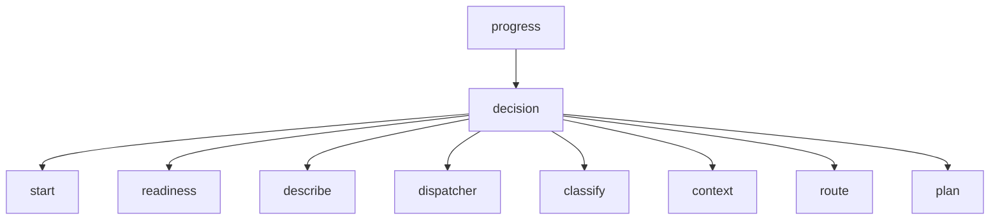
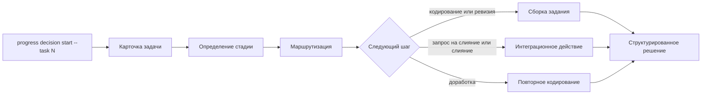

# CLI контура принятия решения

## 1. Назначение документа

Настоящий документ описывает, как контур принятия решения должен быть представлен в CLI комплекса «Прогресс». Его задача состоит в фиксации ручного интерфейса для запуска полного прикладного цикла по номеру задачи, а также для раздельной диагностики внутренних стадий контура.

Документ описывает целевую схему CLI для данного контура. Она согласована с общей структурой `cobra`, уже используемой для веток `integration` и `execution`, но не означает, что все перечисленные команды уже реализованы в кодовой базе.

## 2. Практический приоритет CLI

На первом прикладном этапе CLI контура должен обеспечивать следующий маршрут:

1. принять номер задачи;
2. запустить кодирующий каскад;
3. по структурированному результату кодирования открыть запрос на слияние;
4. запустить ревизию;
5. вернуть замечания на доработку;
6. повторно запустить ревизию;
7. инициировать слияние при положительном заключении.

После стабилизации этого маршрута CLI должен быть расширен режимами проверки готовности задачи к исполнению и синтеза подробного описания.

CLI нужен контуру принятия решения не только как ручной интерфейс, но и как средство:

- локальной диагностики правил;
- воспроизводимого разбора конкретного сигнала;
- проверки полноты контекста;
- наблюдения за маршрутом выбора решения;
- ручной подготовки задания для контура исполнения.

Общий CLI также должен позволять имитировать как внешний входящий сигнал, так и внутренний повторный вызов из уже идущего цикла обработки.

Для данного контура это особенно важно, поскольку его корректность определяется не только итоговым типом решения, но и прозрачностью оснований, по которым это решение было выбрано.

## 3. Состав команд

В минимальной конфигурации целесообразно предусмотреть следующие команды:

- `progress decision start`;
- `progress decision readiness`;
- `progress decision describe`;
- `progress decision dispatcher`;
- `progress decision classify`;
- `progress decision context`;
- `progress decision route`;
- `progress decision plan`.

## 4. Назначение команд

### 4.1 `progress decision start`

Команда выполняет полный проход контура принятия решения по одной задаче. На первом практическом этапе основным входом для неё должен быть номер задачи. Она должна:

1. принять номер задачи;
2. получить карточку задачи через интеграционный контур;
3. поднять доступный проектный и оперативный контекст;
4. определить текущую стадию полного цикла;
5. выбрать следующий шаг;
6. при необходимости сформировать задание кодирующему или ревизионному каскаду;
7. при необходимости инициировать открытие запроса на слияние, постановку замечаний, повторную ревизию или слияние.

Это основная команда полного вызова ветки `decision`.

Базовый пример вызова:

```bash
progress decision start --task 123
```

На более позднем этапе команда должна поддерживать и повторный запуск по внутреннему структурированному входу, если требуется воспроизвести уже начатый цикл.

### 4.2 `progress decision readiness`

Команда отдельно запускает проверку готовности задачи к исполнению. Она нужна для различения двух состояний:

- задача уже пригодна для запуска основного цикла;
- задача требует построения подробного описания.

Результатом должны быть:

- признак готовности к исполнению;
- перечень недостающих сведений постановки;
- решение о необходимости построения подробного описания.

### 4.3 `progress decision describe`

Команда запускает режим синтеза подробного описания для задачи, признанной недостаточно определённой.

Результатом должны быть:

- формализованное задание на построение подробной постановки;
- итоговый артефакт подробного описания;
- возможность повторно подать задачу в `readiness` или `start`.

### 4.4 `progress decision dispatcher`

Команда вызывает координирующую часть контура без обязательного выполнения всех стадий. Она нужна для ответа на вопрос: какие этапы будут задействованы для данного сигнала и какие правила маршрутизации сработают.

Результатом должны быть:

- список активированных стадий;
- определённый класс сигнала;
- ожидаемый тип выходного решения;
- диагностические признаки по контексту и ограничениям.

### 4.5 `progress decision classify`

Команда отдельно запускает классификатор сигнала. Она нужна для проверки того, как контур распознаёт событие до начала более дорогих стадий.

Результатом должны быть:

- класс сигнала;
- инженерный тип задачи, если он уже может быть определён;
- набор признаков, по которым классификатор принял решение.

### 4.6 `progress decision context`

Команда отдельно проверяет полноту контекста, достаточного для принятия решения. Она должна уметь отвечать на вопрос: можно ли уже сейчас маршрутизировать задачу или требуется `enrich`, `await` либо `defer`.

Результатом должны быть:

- перечень обязательных сведений для данного типа задачи;
- перечень уже доступных сведений;
- перечень недостающих сведений;
- различение между извлекаемым дефицитом и отсутствием ещё не наступившего события.

### 4.7 `progress decision route`

Команда отдельно вызывает маршрутизатор решений. Она полезна, когда входной контекст уже собран и требуется проверить только выбор итогового типа решения.

Результатом должны быть:

- `DecisionType`;
- приоритет;
- причины выбора;
- исполнительный профиль, если выбран режим `execute`;
- причины `reject`, `defer` или `await`, если они сработали.

### 4.8 `progress decision plan`

Команда отдельно формирует задание для исполнительного контура на основе уже принятого решения. На практическом маршруте она должна использоваться для трёх основных случаев:

- запуск кодирующего каскада;
- запуск ревизионного каскада;
- запуск каскада синтеза подробного описания.

Результатом должны быть:

- нормализованный `ExecutionPlan`;
- выбранный профиль исполнения;
- минимальный набор ограничений для последующей стадии;
- пригодный для передачи в `progress execution start` или `progress execution launch` блок данных.

## 5. Схема дерева команд



## 6. Общая схема вызова

Полный вызов `progress decision start` на основном прикладном треке должен соответствовать следующему внутреннему маршруту:

1. приём номера задачи;
2. получение карточки задачи;
3. определение текущей стадии цикла;
4. маршрутизация следующего шага;
5. при необходимости сборка задания на исполнение;
6. при необходимости запуск интеграционного действия следующей стадии.



## 7. Входной формат CLI

Для первого этапа желательно поддержать два режима входа:

1. режим запуска по номеру задачи;
2. режим чтения структурированного входа из файла.

Минимальный набор флагов для ветки `decision`:

- `--task` — номер задачи как основной вход первого прикладного этапа;
- `--signal-kind` — тип нормализованного сигнала;
- `--signal-source` — источник сигнала;
- `--object-id` — идентификатор объекта задачи;
- `--repo` — репозиторий, если применимо;
- `--state-file` — путь к файлу проектного состояния;
- `--context-file` — путь к файлу оперативного контекста;
- `--input` — путь к файлу с полным структурированным входом;
- `--profile-hint` — желаемый исполнительный профиль, если он допустим только как подсказка;
- `--format` — формат вывода: `text` или `json`.

Если задан `--input`, он должен иметь приоритет над частными флагами и позволять передавать полный `DecisionContext` для воспроизводимого повтора. Если задан `--task`, он должен использоваться как основной прикладной режим первого этапа.

Сквозные флаги для ветки `decision`:

- `--dry-run` — формирует решение, может обращаться за чтением контекста, но не выполняет внешние действия записи и не запускает необратимые интеграционные операции;
- `--explain` — печатает основания решения, выбранные правила, использованные источники контекста и причины выбора следующего шага.

## 8. Выходной формат CLI

Для контура принятия решения предпочтителен двуслойный вывод:

1. краткое диагностическое резюме строками `key=value`;
2. при необходимости полный JSON-блок решения.

Минимальные поля краткого вывода:

- `signal-kind`;
- `task-kind`;
- `decision-type`;
- `priority`;
- `selected-profile`;
- `missing-field`;
- `missing-object`;
- `policy-constraint`;
- `defer-reason`;
- `reject-reason`.

Если решение равно `execute`, CLI дополнительно должен печатать сведения о плане исполнения. Если решение относится к интеграционному действию следующей стадии, CLI должен печатать структуру соответствующего запроса. Если решение относится к проверке готовности, CLI должен явно различать готовность к исполнению и необходимость построения подробного описания.

При включённом `--explain` поверх краткого результата должны дополнительно выводиться:

- сработавшие правила маршрутизации;
- источники, из которых был собран контекст;
- причины выбора или отклонения конкретного исполнительного профиля;
- причины, по которым внешнее действие было подавлено режимом `--dry-run`, если такой режим активен.

## 9. Изолированные режимы вызова

Изолированные команды нужны не для прохождения полного цикла, а для локальной проверки стадии.

### 9.1 Запуск полного цикла по задаче

```bash
progress decision start --task 123
```

Ожидаемый результат:

1. по номеру задачи извлекается карточка;
2. определяется текущая стадия обработки;
3. выбирается следующий шаг полного цикла;
4. при необходимости запускается кодирование, ревизия, доработка, открытие запроса на слияние или слияние.

### 9.2 Вызов классификатора

```bash
progress decision classify \
  --signal-kind issue-comment \
  --signal-source github \
  --object-id 123 \
  --repo owner/name
```

Ожидаемый результат:

1. определяется класс сигнала;
2. фиксируются признаки распознавания;
3. при возможности определяется `task-kind`.

### 9.3 Проверка полноты контекста

```bash
progress decision context \
  --signal-kind pr-review \
  --object-id 456 \
  --repo owner/name \
  --context-file .progress/context/pr-456.json
```

Ожидаемый результат:

1. определяется перечень обязательных сведений;
2. печатается список недостающих данных;
3. различается, нужен ли `enrich` или `await`.

### 9.4 Проверка маршрутизации

```bash
progress decision route --input .progress/decision/request.json --format json
```

Ожидаемый результат:

1. выбирается `DecisionType`;
2. печатаются основания решения;
3. при `execute` возвращается выбранный исполнительный профиль.

### 9.5 Формирование задания на исполнение

```bash
progress decision plan --input .progress/decision/request.json
```

Ожидаемый результат:

1. для `execute` формируется `ExecutionPlan`;
2. в вывод включаются ограничения для контура исполнения;
3. результат пригоден для последующей передачи в ветку `execution`.

### 9.6 Проверка готовности задачи

```bash
progress decision readiness --task 123
```

Ожидаемый результат:

1. определяется, готова ли задача к исполнению;
2. при нехватке постановки задача помечается как требующая подробного описания;
3. результат может быть передан в `progress decision describe`.

### 9.7 Синтез подробного описания

```bash
progress decision describe --task 123
```

Ожидаемый результат:

1. запускается построение подробной постановки;
2. результат возвращается как артефакт задачи;
3. задача может быть повторно подана в `progress decision readiness`.

## 10. Связь с другими ветками CLI

CLI контура принятия решения не должен дублировать функции соседних веток, но обязан согласованно с ними работать.

Связь с `integration`:

- `decision start --task <N>` должен уметь инициировать получение карточки задачи по номеру;
- `decision context` и `decision start` могут указывать, какой интеграционный запрос требуется для пополнения контекста;
- при диагностике допускается вывод рекомендуемого вызова `progress integration ...`;
- при последующей автоматизации именно контур интеграции должен выполнять запрос, а не сам `decision`-CLI.

Связь с `execution`:

- `decision plan` должен формировать структуру, пригодную для передачи в `progress execution start`;
- `decision start` на первом прикладном этапе должен уметь инициировать передачу задачи в кодирующий и ревизионный каскады;
- фактический запуск остаётся ответственностью ветки `execution`.

## 11. Допустимый порядок ручной работы

Рекомендуемый ручной маршрут пользователя должен выглядеть так:

1. запустить `progress decision start --task <номер>` для основного цикла;
2. при необходимости локально проверить распознавание сигнала через `progress decision classify`;
3. при необходимости проверить полноту контекста через `progress decision context`;
4. при необходимости отдельно проверить `progress decision readiness`;
5. при необходимости запустить `progress decision describe` по задаче, признанной недостаточно определённой.

Такой порядок упрощает диагностику и делает ошибку маршрутизации наблюдаемой до фактического запуска исполнения.

## 12. Минимальный состав внутренних модулей

Для соответствия описанной CLI-схеме достаточно предусмотреть следующие элементы в кодовой базе:

- `internal/decision/service.go` — фасад контура принятия решения;
- `internal/decision/model/types.go` — типы сигнала, контекста, решения и плана;
- `internal/decision/classifier.go` — правила классификации сигнала;
- `internal/decision/context.go` — анализ полноты контекста;
- `internal/decision/router.go` — выбор типа решения;
- `internal/decision/plan.go` — формирование задания на исполнение;
- `internal/decision/readiness.go` — проверка готовности задачи к исполнению;
- `internal/decision/describe.go` — постановка синтеза подробного описания;
- `internal/cli/decision.go` — ветка CLI-команд `progress decision ...`.

На первом этапе допустимо, чтобы часть этой логики находилась внутри одного сервиса, если интерфейс команд уже разделён по стадиям.

## 13. Ближайшие задачи реализации CLI

На первом кодовом этапе для данного контура требуется:

1. зарегистрировать ветку `decision` в `root`-команде;
2. реализовать `progress decision start --task <номер>` как точку входа полного цикла;
3. реализовать связку `start -> execution` для кодирующего каскада;
4. реализовать переходы к открытию запроса на слияние, ревизии, доработке и слиянию;
5. реализовать `progress decision readiness` и `progress decision describe`;
6. ввести единый тип структурированного входа для повтора решения;
7. определить формат вывода `key=value` и `json`.

## 14. Принцип проектирования команд

Для ветки `decision` следует принять следующие правила:

1. все команды работают с одной канонической моделью `DecisionContext`;
2. команда `start` является точкой входа полного цикла по номеру задачи;
3. команды `classify`, `context`, `route`, `plan`, `readiness` и `describe` являются стадийными и диагностическими;
4. команда `dispatcher` показывает маршрут и основания, но не подменяет собой итоговое решение;
5. ветка `decision` определяет следующий шаг цикла и координирует переход между стадиями, не подменяя собой контуры интеграции и исполнения.
