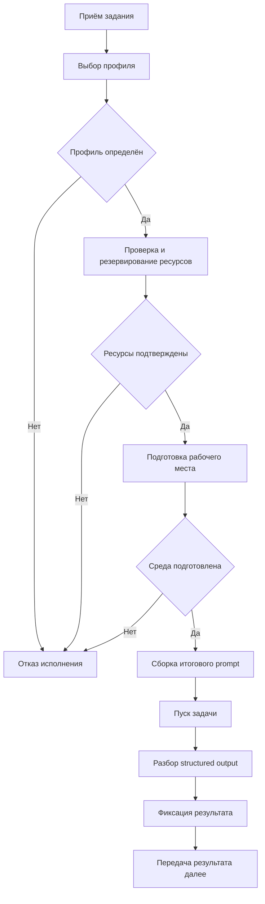

# Алгоритм работы контура исполнения

## 1. Назначение документа

Настоящий документ фиксирует внутренний порядок работы контура исполнения, состав его модулей и правила прохождения задачи по исполнительным стадиям.

Документ предназначен для начального этапа реализации и описывает минимальный алгоритм без привязки к конкретным языковым моделям, внешним платформам или способам изоляции среды.

## 2. Состав модуля исполнения

В минимальной конфигурации контур исполнения включает следующие элементы:

- диспетчер исполнения;
- модуль выбора исполнительного профиля;
- подсистему ресурсного снабжения;
- модуль подготовки исполнительного рабочего места;
- модуль сборки итогового prompt из structured input;
- модуль пуска задачи;
- модуль разбора structured output;
- журнал стадий исполнения.

## 3. Функциональная схема

Схема отражает минимальный линейный режим. В последующих этапах допускается расширение ветвлениями, повторными попытками, отложенным пуском и альтернативными профилями исполнения.

## 4. Роль внутренних модулей

### 4.1 Диспетчер исполнения

Диспетчер исполнения принимает задание, определяет допустимую последовательность стадий, вызывает внутренние модули и фиксирует прохождение задачи по этапам.

Диспетчер не изменяет целевую постановку задачи. Его функция состоит в координации исполнительного каскада и контроле состояния обработки.

### 4.2 Модуль выбора исполнительного профиля

Модуль выбора профиля определяет способ проведения задачи по её классу, режиму, ограничениям среды и требованиям к завершающим действиям.

Результатом работы модуля является исполнительный профиль, который содержит:

- тип вычислительного каскада;
- требования к ресурсам;
- требования к рабочему месту;
- ограничения на запуск;
- условия завершения.

### 4.3 Подсистема ресурсного снабжения

Подсистема ресурсного снабжения проверяет наличие требуемых ресурсов и выполняет предварительное резервирование ограниченных единиц.

К контролируемым сущностям могут относиться:

- вычислительные квоты;
- бюджеты вызовов внешних систем;
- доступы к репозиториям и каталогам;
- контейнерные и файловые пресеты;
- иные инфраструктурные ограничения.

### 4.4 Модуль подготовки исполнительного рабочего места

Модуль подготовки рабочего места формирует воспроизводимую исполнительную среду, соответствующую выбранному профилю и подтверждённым ресурсным ограничениям.

Рабочее место может представлять собой:

- локальный каталог;
- репозиторий;
- контейнерную среду;
- иную изолированную конфигурацию исполнения.

### 4.5 Модуль сборки итогового prompt

Перед запуском вычислительного каскада контур исполнения должен принять структурированный контекст задачи и преобразовать его в итоговое представление для исполнителя.

Задача данного модуля состоит не в хранении исходного structured input как такового, а в его прикладной интерпретации для выбранного профиля исполнения. Модуль может:

- объединять текстовую постановку и structured input в единый prompt;
- включать в prompt описание требуемой структуры ответа;
- исключать или добавлять отдельные секции в зависимости от профиля и флагов запуска.

Таким образом, форма представления structured input и structured output для языковой модели относится к ответственности контура исполнения, а не внешнего инициатора задачи.

### 4.6 Модуль пуска задачи

Модуль пуска задачи выполняет заключительную стадию диспетчеризации: принимает подготовленное рабочее место и уже подтверждённые аллокации, после чего инициирует непосредственный запуск вычислительного каскада.

Данный модуль не выполняет повторного согласования профиля и не резервирует ресурсы заново. Его назначение состоит в том, чтобы начать выполнение задачи в уже подготовленной среде.

### 4.7 Модуль разбора structured output

После завершения вычислительного каскада ответ должен быть разделён на две части:

- итоговый текстовый результат;
- structured output для машинной обработки.

Модуль разбора обязан выделить structured output, проверить его на соответствие ожидаемой схеме и вернуть нормализованную структуру дальше по цепочке. Если structured output отсутствует или не проходит разбор, контур исполнения не должен терять свободный текст результата и обязан вернуть диагностируемое состояние разбора.

## 5. Основной порядок работы

Минимальный порядок прохождения задачи имеет следующий вид:

1. диспетчер принимает задание на исполнение;
2. выполняется выбор исполнительного профиля;
3. подтверждаются требования к ресурсам и выполняется резервирование;
4. подготавливается исполнительное рабочее место;
5. из structured input и текстовой постановки собирается итоговый prompt;
6. выполняется пуск задачи;
7. разбирается structured output и фиксируется итог исполнения;
8. состояние завершения передаётся далее.

## 6. Алгоритм полного исполнения

На начальном этапе отказ на любой стадии завершает текущий цикл исполнения без автоматической повторной попытки. Правила повторного запуска вводятся позднее как отдельное расширение.

## 7. Алгоритм последней стадии диспетчера

Отдельный модуль пуска предназначен для имитации и последующей реализации завершающего этапа работы диспетчера.

Его порядок работы имеет следующий вид:

1. принять ссылку на подготовленное рабочее место;
2. принять подтверждённые ресурсные аллокации;
3. проверить готовность среды к запуску;
4. инициировать вычислительный каскад;
5. зафиксировать факт старта и итоговое состояние.

Этот режим требуется для изолированной отладки финальной стадии исполнения без повторного прохождения всего контура.

## 8. Порядок журналирования

В минимальной конфигурации журнал должен фиксировать:

- поступление задания в диспетчер;
- выбор профиля или отказ выбора;
- результат проверки ресурсов;
- результат подготовки рабочего места;
- факт сборки итогового prompt и применённый режим structured input/output;
- факт пуска задачи;
- результат разбора structured output;
- итоговое состояние исполнения.

Журналирование вводится как обязательная часть контура, поскольку без него дальнейшая верификация и разбор отказов становятся затруднительными.

## 9. Ближайшие задачи реализации

На первом кодовом этапе следует зафиксировать:

1. интерфейс диспетчера исполнения;
2. интерфейс выбора профиля;
3. интерфейс ресурсного снабжения;
4. интерфейс подготовки рабочего места;
5. интерфейс сборки итогового prompt и правил structured input/output;
6. интерфейс модуля пуска задачи;
7. интерфейс разбора structured output;
8. минимальную модель статуса исполнения;
9. единый порядок журналирования стадий.
