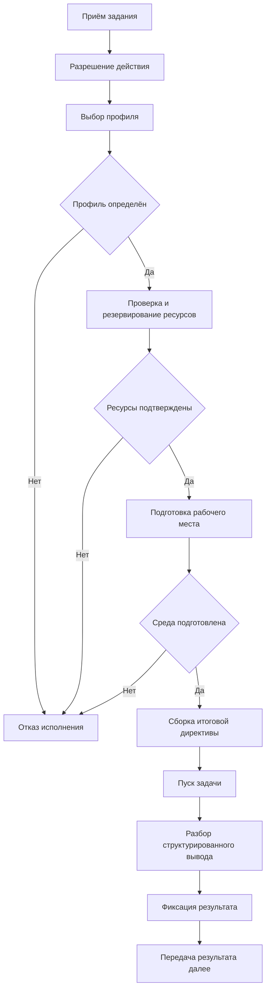
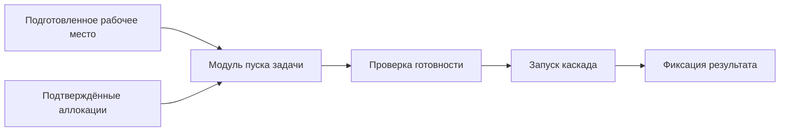

# Алгоритм работы контура исполнения

## 1. Назначение документа

Настоящий документ фиксирует внутренний порядок работы контура исполнения, состав его модулей и правила прохождения задачи по исполнительным стадиям.

Документ предназначен для начального этапа реализации и описывает минимальный алгоритм без привязки к конкретным языковым моделям, внешним платформам или способам изоляции среды.

## 2. Состав модуля исполнения

В минимальной конфигурации контур исполнения включает следующие элементы:

- диспетчер исполнения;
- нулевой этап разрешения действия;
- исполнитель встроенных операций действия;
- модуль выбора исполнительного профиля;
- подсистему ресурсного снабжения;
- модуль подготовки исполнительного рабочего места;
- модуль сборки итоговой директивы из структурированного ввода;
- модуль пуска задачи;
- модуль разбора структурированного вывода;
- журнал стадий исполнения.

## 3. Функциональная схема

Схема отражает минимальный порядок для действия инженерного синтеза. В текущей реализации этот порядок больше не зашит в сервис исполнения напрямую: контур сначала разрешает действие, затем проходит список операций, закреплённый в `Action.Operations`. Для простого запуска используется встроенное действие инженерного синтеза с операциями `resolve-action`, `prepare-data`, `resolve-profile`, `allocate-resources`, `prepare-workplace`, `build-directive`, `launch-synthesis`, `parse-result`, `finalize`.

## 4. Роль внутренних модулей

### 4.1 Диспетчер исполнения

Диспетчер исполнения принимает задание, разрешает действие на нулевом этапе, вызывает операции этого действия и фиксирует прохождение задачи по этапам.

Диспетчер не изменяет целевую постановку задачи. Его функция состоит в координации исполнительного каскада и контроле состояния обработки.

Если действие не требует рабочего места или содержательного синтеза, соответствующие встроенные операции получают состояние `skipped`, а не выполняют прежний обязательный линейный маршрут.

### 4.2 Модуль выбора исполнительного профиля

Модуль выбора профиля определяет технический режим проведения уже разрешённого действия по ограничениям среды и требованиям к запуску.

Результатом работы модуля является исполнительный профиль, который содержит:

- режим выполнения;
- `model-binding` и политику `allow-model-fallback`;
- требования к структурированному выводу и дополнительным частям директивы;
- требования к рабочему месту.

Профиль не выбирается внешним инициатором вызова действия. Он разрешается внутри контура по действию и проектной конфигурации.

### 4.3 Подсистема ресурсного снабжения

Подсистема ресурсного снабжения проверяет наличие требуемых ресурсов и выполняет предварительное резервирование ограниченных единиц. На этой стадии `model-binding` или явная пара `runner/model` разрешаются в фактическое выделение ресурсов для запуска. Файл ресурсов хранит окружения исполнения, инструменты исполнения, ресурсы исполнения и привязки ресурсов; резервный выбор через `defaults.model-binding` допустим только при явно разрешённой политике, а отсутствие привязки по умолчанию в таком сценарии считается диагностируемой ошибкой.

К контролируемым сущностям относятся:

- зарегистрированные окружения исполнения;
- зарегистрированные инструменты исполнения;
- зарегистрированные ресурсы исполнения;
- семантические привязки ресурсов;
- вычислительные квоты;
- бюджеты вызовов внешних систем;
- доступы к репозиториям и каталогам;
- контейнерные и файловые пресеты;
- иные инфраструктурные ограничения.

### 4.4 Модуль подготовки исполнительного рабочего места

Модуль подготовки рабочего места формирует воспроизводимое окружение исполнения, соответствующее выбранному профилю и подтверждённым ресурсным ограничениям.

Рабочее место может представлять собой:

- локальный каталог или корень репозитория;
- отдельный `git worktree`;
- контейнерную среду;
- иную изолированную конфигурацию исполнения.

Если разрешённое действие требует репозиторий, источник берётся из канонической задачи в задании на выполнение либо получается внутренней операцией действия. Модуль материализует локальную кэш-копию репозитория в служебном каталоге текущего проекта, проверяет `origin`, выполняет `git fetch`, а затем создаёт `worktree` от ветки по умолчанию целевого удалённого `origin`. Если источник репозитория не определён и действие допускает локальный маршрут, используется текущий git-репозиторий процесса.

### 4.5 Модуль сборки итоговой директивы

Перед запуском вычислительного каскада контур исполнения должен принять структурированный контекст задачи и преобразовать его в итоговое представление для исполнителя.

Задача данного модуля состоит не в хранении исходного структурированного ввода как такового, а в его прикладной интерпретации для выбранного профиля исполнения. Модуль может:

- объединять текстовую постановку и структурированный ввод в единую исполнительную директиву;
- включать в директиву описание требуемой структуры ответа;
- исключать или добавлять отдельные секции в зависимости от действия и разрешённого профиля.

Таким образом, форма представления структурированного ввода и структурированного вывода для языковой модели относится к ответственности контура исполнения, а не внешнего инициатора задачи.

### 4.6 Модуль пуска задачи

Модуль пуска задачи выполняет заключительную стадию диспетчеризации: принимает подготовленное рабочее место и уже подтверждённые аллокации, после чего инициирует непосредственный запуск вычислительного каскада.

Данный модуль не выполняет повторного согласования профиля и не резервирует ресурсы заново. Его назначение состоит в том, чтобы начать выполнение задачи в уже подготовленном окружении исполнения с уже разрешённой аллокацией `runner/model`.

### 4.7 Модуль разбора структурированного вывода

После завершения вычислительного каскада ответ должен быть разделён на две части:

- итоговый текстовый результат;
- структурированный вывод для машинной обработки.

Модуль разбора обязан выделить структурированный вывод, проверить его на соответствие ожидаемой схеме и вернуть нормализованную структуру дальше по цепочке. Если структурированный вывод отсутствует или не проходит разбор, контур исполнения не должен терять свободный текст результата и обязан вернуть диагностируемое состояние разбора.

## 5. Основной порядок работы

Минимальный порядок прохождения задачи имеет следующий вид:

1. диспетчер принимает задание на исполнение;
2. на нулевом этапе разрешается действие и фиксируется его список операций;
3. выполняется операция подготовки данных;
4. если действие требует синтеза, выбирается исполнительный профиль и подтверждаются ресурсы;
5. если действие требует рабочее место, подготавливается исполнительное рабочее место;
6. для действия синтеза собирается исполнительная директива и выполняется пуск;
7. разбирается структурированный вывод;
8. выполняется завершающая фиксация результата;
9. состояние завершения передаётся далее.

## 6. Алгоритм полного исполнения

В одиночном режиме отказ на любой стадии завершает текущий запуск исполнения без автоматической повторной попытки. Повторение, ревизия и доработка результата относятся к маршрутам контура принятия решения и передаются в контур исполнения как новые задания на выполнение.

## 7. Алгоритм последней стадии диспетчера

Отдельный модуль пуска предназначен для имитации и последующей реализации завершающего этапа работы диспетчера.

Его порядок работы имеет следующий вид:

1. принять ссылку на подготовленное рабочее место;
2. принять подтверждённые ресурсные аллокации;
3. проверить готовность среды к запуску;
4. инициировать вычислительный каскад;
5. зафиксировать факт старта и итоговое состояние.

Этот внутренний режим требуется для отладки финальной стадии исполнения без повторного прохождения всего контура. Он не является отдельным публичным входом ветки `execution`.

## 8. Порядок журналирования

В минимальной конфигурации журнал должен фиксировать:

- поступление задания в диспетчер;
- выбор профиля или отказ выбора;
- результат проверки ресурсов;
- результат подготовки рабочего места;
- факт сборки итоговой директивы и применённый режим структурированного ввода и вывода;
- факт пуска задачи;
- результат разбора структурированного вывода;
- итоговое состояние исполнения.

Журналирование вводится как обязательная часть контура, поскольку без него дальнейшая верификация и разбор отказов становятся затруднительными.

## 9. Ближайшие задачи реализации

На первом кодовом этапе следует зафиксировать:

1. интерфейс диспетчера исполнения;
2. интерфейс выбора профиля;
3. интерфейс ресурсного снабжения;
4. интерфейс подготовки рабочего места;
5. интерфейс сборки итоговой директивы и правил структурированного ввода и вывода;
6. интерфейс модуля пуска задачи;
7. интерфейс разбора структурированного вывода;
8. минимальную модель статуса исполнения;
9. единый порядок журналирования стадий.
