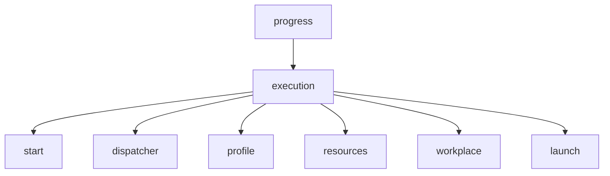
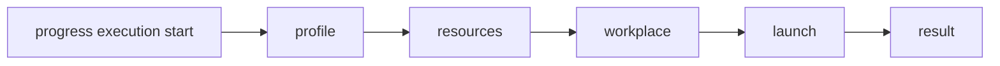
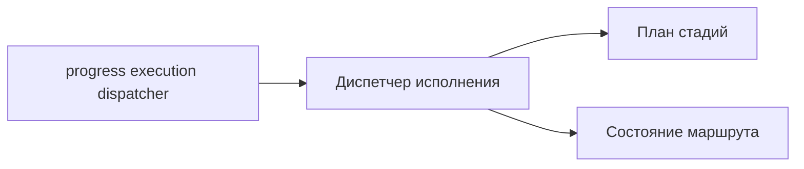
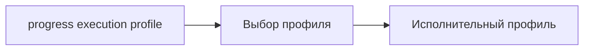
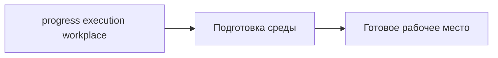
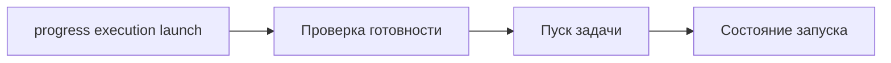

# CLI контура исполнения

## 1. Назначение документа

Настоящий документ определяет начальную схему CLI-вызовов для контура исполнения. Команды предназначены как для полного запуска контура, так и для изолированного вызова его внутренних модулей.

CLI рассматривается как основной ручной интерфейс первичной реализации на Go с использованием `cobra`.

## 2. Состав команд

В минимальной конфигурации предусматриваются следующие команды:

- `progress execution start`;
- `progress execution dispatcher`;
- `progress execution profile`;
- `progress execution resources`;
- `progress execution workplace`;
- `progress execution launch`.

## 3. Назначение команд

### 3.1 `progress execution start`

Команда выполняет полный запуск контура исполнения. Внутренне она инициирует последовательный проход по исполнительным стадиям и возвращает итоговый результат полного каскада.

### 3.2 `progress execution dispatcher`

Команда вызывает диспетчер исполнения как отдельный модуль. Данный режим предназначен для диагностики маршрута исполнения, наблюдения за порядком стадий и последующей отладки правил диспетчеризации.

### 3.3 `progress execution profile`

Команда отдельно вызывает модуль выбора исполнительного профиля. Результатом является решение о том, какой профиль должен применяться к данному заданию и какие ограничения он накладывает.

### 3.4 `progress execution resources`

Команда отдельно вызывает подсистему ресурсного снабжения. Она предназначена для проверки доступности ресурсов и имитации резервирования без обязательного запуска всего исполнительного контура.

### 3.5 `progress execution workplace`

Команда отдельно вызывает модуль подготовки исполнительного рабочего места. Она используется для проверки правил подготовки среды и воспроизводимости исполнительной конфигурации.

### 3.6 `progress execution launch`

Команда вызывает модуль пуска задачи. Она соответствует последней стадии работы диспетчера после завершения аллокаций и подготовки рабочего места.

Назначение команды состоит в изолированной проверке непосредственного запуска задачи без повторного прохождения стадий выбора профиля и резервирования ресурсов.

## 4. Схема дерева команд

## 5. Порядок полного вызова

Полный вызов `progress execution start` должен соответствовать следующему внутреннему маршруту:

1. выбор профиля;
2. проверка и резервирование ресурсов;
3. подготовка рабочего места;
4. пуск задачи;
5. фиксация результата.

## 6. Порядки изолированного вызова

Изолированные команды предназначены не для полного решения задачи, а для локальной проверки отдельной стадии.

### 6.1 Вызов диспетчера

### 6.2 Вызов выбора профиля

### 6.3 Вызов ресурсного снабжения

### 6.4 Вызов подготовки рабочего места

### 6.5 Вызов модуля пуска

## 7. Принцип проектирования команд

Для начального этапа принимаются следующие правила:

1. все команды ветки `execution` относятся к одному контуру и используют общий формат входного задания;
2. команда `start` является пользовательской точкой полного запуска;
3. команды `profile`, `resources`, `workplace` и `launch` являются модульными и предназначены для локальной проверки стадий;
4. команда `dispatcher` отражает координирующую роль диспетчера и не подменяет собой отдельные стадии;
5. `launch` рассматривается как специализированная команда последнего этапа диспетчеризации.

## 8. Ближайшие задачи реализации CLI

На первом кодовом этапе требуется:

1. ввести корневую команду `progress`;
2. ввести ветку `execution`;
3. зарегистрировать перечисленные подкоманды;
4. обеспечить единый формат ручного входа для всех команд ветки;
5. привязать команды к заглушечным внутренним модулям;
6. вывести журналы прохождения стадий в стандартный поток вывода.
