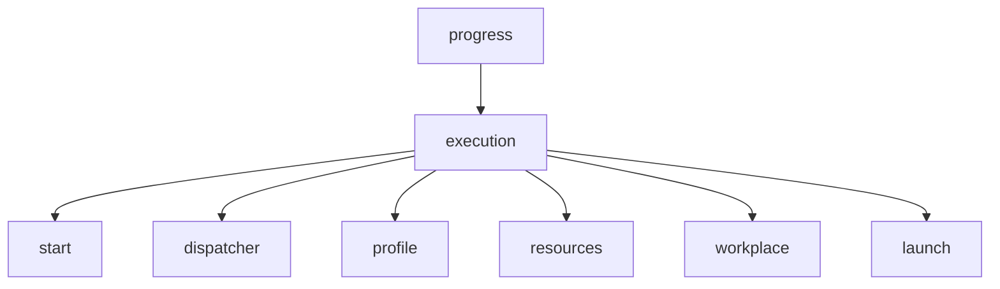
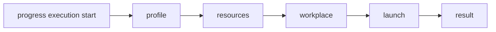
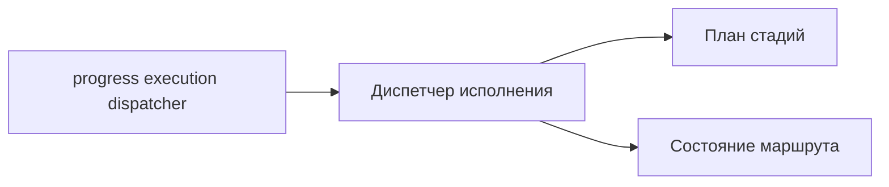
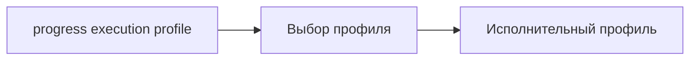
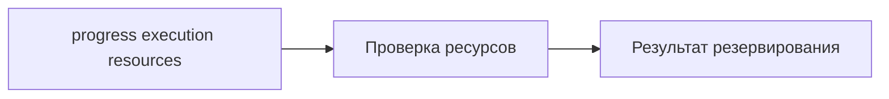
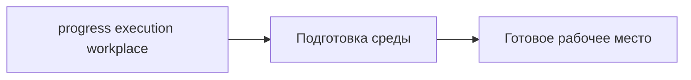
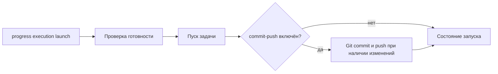

# CLI контура исполнения

## 1. Назначение документа

Настоящий документ определяет начальную схему CLI-вызовов для контура исполнения. Команды предназначены как для полного запуска контура, так и для изолированного вызова его внутренних модулей.

CLI рассматривается как основной ручной интерфейс первичной реализации на Go с использованием `cobra`.

## 2. Состав команд

В минимальной конфигурации предусматриваются следующие команды:

- `progress execution start`;
- `progress execution dispatcher`;
- `progress execution profile`;
- `progress execution resources`;
- `progress execution workplace`;
- `progress execution launch`.

## 3. Назначение команд

### 3.1 `progress execution start`

Команда выполняет полный запуск контура исполнения. Внутренне она инициирует последовательный проход по исполнительным стадиям и возвращает итоговый результат полного каскада.

### 3.2 `progress execution dispatcher`

Команда вызывает диспетчер исполнения как отдельный модуль. Данный режим предназначен для диагностики маршрута исполнения, наблюдения за порядком стадий и последующей отладки правил диспетчеризации.

### 3.3 `progress execution profile`

Команда отдельно вызывает модуль выбора исполнительного профиля. Результатом является решение о том, какой профиль должен применяться к данному заданию и какие ограничения он накладывает.

Профили исполнения загружаются из репозиторного файла `.progress/execution/profiles.json`. Файл является частью проекта и хранит как общие `defaults`, так и набор именованных профилей.

Минимальная схема файла:

```json
{
  "defaults": {
    "mode": "manual",
    "model": "openai/gpt-5.4",
    "commit-push": false,
    "structured-input": "auto",
    "structured-output": "auto"
  },
  "profiles": {
    "default": {
      "description": "Базовый профиль исполнения через облачную модель по умолчанию"
    },
    "local": {
      "description": "Локальный профиль исполнения через локальную модель",
      "model": "ollama/qwen3.5:2b",
      "structured-output": "off"
    }
  }
}
```

Правила разрешения профиля:

1. если профиль не указан, используется `default`;
2. профиль наследует незаданные поля из блока `defaults`;
3. `model` может быть определена в `defaults` и переопределена в конкретном профиле;
4. `structured-input` определяет, должен ли контур учитывать структурированный ввод и в каком режиме включать его в итоговую директиву;
5. `structured-output` определяет, должен ли контур запрашивать и разбирать структурированный ответ;
6. `description` задаётся на уровне конкретного профиля и используется для CLI-диагностики;
7. если конфиг отсутствует, повреждён или не содержит нужного профиля, команда возвращает диагностируемую ошибку.

В resolved profile команда явно возвращает `description`, `mode`, `model`, `commit-push`, `structured-input` и `structured-output`. Значение `commit-push` по умолчанию безопасное и равно `false`, но может использоваться последующей стадией `launch` как унаследованный признак автокоммита и автопуша.

### 3.4 `progress execution resources`

Команда отдельно вызывает подсистему ресурсного снабжения. Она предназначена для проверки доступности ресурсов и имитации резервирования без обязательного запуска всего исполнительного контура.

### 3.5 `progress execution workplace`

Команда отдельно вызывает модуль подготовки исполнительного рабочего места. Она используется для проверки правил подготовки среды и воспроизводимости исполнительной конфигурации.

В текущей реализации команда принимает `--name` и подготавливает локальное рабочее место в `.progress/workplaces/<name>`. Если каталог ещё не существует, команда создаёт `git worktree` с локальной веткой `<name>` от актуальной default branch remote `origin`. Если каталог уже существует, команда не пересоздаёт его, а проверяет, что это валидный `git worktree` и что в нём активна ветка `<name>`.

### 3.6 `progress execution launch`

Команда вызывает модуль пуска задачи. Она соответствует последней стадии работы диспетчера после завершения аллокаций и подготовки рабочего места.

Назначение команды состоит в изолированной проверке непосредственного запуска задачи без повторного прохождения стадий выбора профиля и резервирования ресурсов.

Подробное описание механизма структурированного ввода и вывода, потока данных и требований к расширяемости вынесено в `docs/contours/execution/STRUCTURED_IO.md`. В настоящем документе фиксируются только CLI-аспекты этого механизма.

В текущей реализации команда принимает `--dir`, `--runner`, `--model`, `--prompt`, а также опциональные флаги `--structured-input`, `--structured-output`, `--structured-protocol`, `--structured-mode`, `--structured-output-required`, `--commit-push` и `--commit-message`.

Эффективный `commit-push` для стадии запуска определяется по простому правилу: git-стадия включается, если `--commit-push` передан явно либо если включён одноимённый флаг у выбранного исполнительного профиля.

Если `--commit-push` не задан и профиль также не включает `commit-push`, команда выполняет только исполнительный модуль и возвращает его итоговое резюме.

Если `--structured-output` не указан, executor не добавляет в prompt никакой новой служебной structured-инструкции и поведение остаётся максимально близким к текущему. При этом явные `--structured-protocol` и `--structured-mode` без `--structured-output` считаются ошибкой конфигурации, чтобы поведение не было асимметричным и не создавалось впечатление, что часть флагов молча применяется.

Если `--structured-output` указан, executor сам дописывает в конец prompt короткую детерминированную инструкцию, требующую trailing block `<progress-structured-output>...</progress-structured-output>`. Если `--structured-protocol` не передан явно, для этого режима используется effective default `review-cycle`. Значение `--structured-mode` по умолчанию не подставляется: если флаг не указан, executor не заставляет runner явно выставлять `mode` в injected-инструкции.

Поддерживаются два минимальных протокола:

1. `legacy` — runner должен вернуть JSON-объект с массивами `critical_remarks`, `minor_remarks`, `questions`;
2. `review-cycle` — runner должен вернуть JSON-объект с `protocol_version="review-cycle/v1"`, `summary` и, при необходимости, массивами `remarks`, `questions`, `follow_up_actions`, `changes`; если явно задан `--structured-mode`, injected-инструкция дополнительно требует выставить соответствующий `mode`.

Флаг `--structured-output-required` включает строгую валидацию результата: ошибкой запуска считается отсутствие trailing structured block, невалидный JSON block, пустой или бессмысленный payload, неизвестные top-level поля, пустые объектные элементы внутри `remarks` / `questions` / `follow_up_actions` / `changes`, а также несовпадение ответа с реально запрошенным протоколом и `mode`. Для `review-cycle` strict-режим требует `protocol_version="review-cycle/v1"` и непустой `summary`; если `mode` не был передан отдельным флагом, но уже присутствует в текущем structured input envelope, он тоже считается ожидаемым. Для `legacy` требуется хотя бы один непустой элемент в `critical_remarks`, `minor_remarks` или `questions`.

Эффективные режимы `structured-input` и `structured-output` также определяются через профиль и явные флаги запуска. Профиль задаёт поведение по умолчанию, а флаги `--structured-input` и `--structured-output` имеют приоритет и позволяют явно включить, выключить или переопределить режим обработки для конкретного запуска.

Структурированный ввод нужен для передачи в контур исполнения полноценного контекста задачи. В этом блоке могут находиться:

- постановка и ограничения задачи;
- артефакты предыдущего шага;
- замечания ревью и ответы на них;
- указания о требуемых интеграционных действиях;
- дополнительные поля, введённые расширением конфигурации.

Контур исполнения не обязан передавать этот блок модели в исходном виде. Его задача состоит в том, чтобы на основании структурированного ввода и активного профиля собрать итоговую директиву, пригодную для конкретного исполнительного модуля и модели.

Исполнительный модуль может дополнительно вернуть необязательный структурированный блок в формате JSON внутри секции `<progress-structured-output>...</progress-structured-output>`. Legacy-ключи `critical_remarks`, `minor_remarks` и `questions` по-прежнему принимаются, но сразу нормализуются в канонический конверт цикла ревизии.

Канонический конверт цикла ревизии является единственным каноническим представлением структурированных данных. Поддерживается следующая схема верхнего уровня: `protocol_version`, `mode`, `summary`, `remarks[]`, `questions[]`, `follow_up_actions[]`, `changes[]`. Для `remarks[]` доступны поля `id`, `status`, `response_status`, `severity`, `type`, `title`, `body`, `reply`, `fix_summary`. Если исполнительный модуль присылает смешанный набор данных, legacy-ключи мержатся в тот же конверт, а плоские `critical_remarks`, `minor_remarks` и `questions` затем уже вычисляются из канонической модели как диагностическая проекция.

Основное назначение структурированного вывода состоит в том, чтобы результат можно было использовать в следующих каскадах без повторного разбора свободного текста. Например:

- замечания ревью могут быть автоматически прикреплены к коду через интеграции;
- исполнительный каскад кодирования может получить эти замечания как структурированный ввод следующего запуска;
- исполнительный каскад кодирования может вернуть ответ на комментарий в структурированном выводе;
- структурированный вывод может содержать команды и заключения, например рекомендацию открыть запрос на слияние, признак готовности результата или требование доработки;
- структурированный вывод может содержать поле `commit-message` для автоматического создания коммита.

Исполнительный контур разбирает структурированный вывод только если в конце вывода исполнительного модуля присутствует один явный завершающий блок, допускающий только завершающие пробелы и переводы строки после `</progress-structured-output>`. Теги, встретившиеся внутри обычного текста, примера, промежуточного пояснения или literal JSON string values внутри payload, не должны ломать выделение реального завершающего блока и остаются частью исходного содержимого. Если завершающий блок присутствует, но не парсится, исполнительный контур сохраняет исходный вывод исполнительного модуля в `summary` без заполнения дополнительных полей, чтобы не терять диагностический контекст.

В параметр `--prompt` можно передавать блок структурированного ввода `<progress-structured-input>...</progress-structured-input>`. Исполнительный контур выделяет завершающий входной блок из `prompt`, нормализует его в тот же канонический конверт цикла ревизии и передаёт эту структуру дальше в поток запуска. Если структурированный ввод задан программно, контур исполнения может включить его в `prompt` в исходном виде, преобразовать в инструктивное текстовое представление для модели или дополнить `prompt` описанием ожидаемого структурированного вывода. Это позволяет использовать конверт из предыдущего цикла ревизии как вход для следующего цикла без отдельного legacy-маршрута.

Целевой механизм должен быть расширяемым через конфигурацию. Это означает, что схема структурированного ввода и вывода, правила включения отдельных секций в `prompt` и набор допустимых команд или заключений не должны быть жёстко зашиты только в одном исполнительном пути. Профиль и конфигурационные расширения должны позволять адаптировать поведение под разные типы задач: ревизию, кодирование, ответ на замечания, верификацию и последующие режимы.

В CLI итог печатается в виде отдельного блока `summary<<PROGRESS_SUMMARY ... PROGRESS_SUMMARY`, после которого при наличии структурированных данных выводится секция `structured-output:`. Для канонического конверта цикла ревизии CLI дополнительно печатает строки `review-cycle-protocol-version=...`, `review-cycle-mode=...`, `review-cycle-summary=...` и JSON-строки `review-cycle-remark=...`, `review-cycle-question=...`, `review-cycle-follow-up-action=...`, `review-cycle-change=...`. Эти JSON-строки выводятся без дополнительной whitespace-нормализации, чтобы payload оставался lossless. Legacy-строки `critical-remark=...`, `minor-remark=...` и `question=...` сохраняются как производная диагностическая проекция и для них по-прежнему используется однострочная нормализация.

Если режим `commit-push` эффективно включён, то после успешного завершения исполнительного модуля команда:

1. проверяет, что рабочий каталог является git-репозиторием;
2. определяет текущую активную ветку;
3. проверяет наличие staged, unstaged и untracked изменений;
4. при наличии изменений выполняет `git add -A`, `git commit -m <message>` и `git push`;
5. если upstream у текущей ветки ещё не настроен, выполняет `git push -u origin <branch>`;
6. если изменений нет, корректно пропускает commit и push.

По умолчанию для `--commit-message` используется нейтральное значение `Зафиксировать результат задачи`.

## 4. Схема дерева команд



## 5. Порядок полного вызова

Полный вызов `progress execution start` должен соответствовать следующему внутреннему маршруту:

1. выбор профиля;
2. проверка и резервирование ресурсов;
3. подготовка рабочего места;
4. пуск задачи;
5. фиксация результата.



## 6. Порядки изолированного вызова

Изолированные команды предназначены не для полного решения задачи, а для локальной проверки отдельной стадии.

### 6.1 Вызов диспетчера



### 6.2 Вызов выбора профиля



### 6.3 Вызов ресурсного снабжения



### 6.4 Вызов подготовки рабочего места



Пример вызова:

```bash
progress execution workplace --name feature-brief
```

Ожидаемое поведение:

1. создаётся или переиспользуется каталог `.progress/workplaces/feature-brief`;
2. каталог должен быть зарегистрирован как `git worktree`;
3. активная ветка внутри каталога должна совпадать с именем `feature-brief`.

### 6.5 Вызов модуля пуска



Пример вызова только runner:

```bash
progress execution launch --dir .progress/workplaces/feature-brief --prompt "Подготовь изменения"
```

Пример вызова runner с последующим commit и push:

```bash
progress execution launch \
  --dir .progress/workplaces/feature-brief \
  --prompt "Подготовь изменения" \
  --commit-push \
  --commit-message "Apply task result"
```

Ожидаемое поведение:

1. без `--commit-push` выполняется только runner;
2. с `--commit-push` или с `commit-push=true` у профиля git-операции запускаются только после успешного завершения runner;
3. при ошибке runner git-операции не выполняются;
4. при отсутствии изменений commit и push пропускаются без ошибки;
5. summary содержит компактный результат git-стадии, например `git=no-changes` или `git=committed+pushed`.

## 7. Принцип проектирования команд

Для начального этапа принимаются следующие правила:

1. все команды ветки `execution` относятся к одному контуру и используют общий формат входного задания;
2. команда `start` является пользовательской точкой полного запуска;
3. команды `profile`, `resources`, `workplace` и `launch` являются модульными и предназначены для локальной проверки стадий;
4. команда `dispatcher` отражает координирующую роль диспетчера и не подменяет собой отдельные стадии;
5. `launch` рассматривается как специализированная команда последнего этапа диспетчеризации.

## 8. Ближайшие задачи реализации CLI

На первом кодовом этапе требуется:

1. ввести корневую команду `progress`;
2. ввести ветку `execution`;
3. зарегистрировать перечисленные подкоманды;
4. обеспечить единый формат ручного входа для всех команд ветки;
5. привязать команды к заглушечным внутренним модулям;
6. вывести журналы прохождения стадий в стандартный поток вывода.
