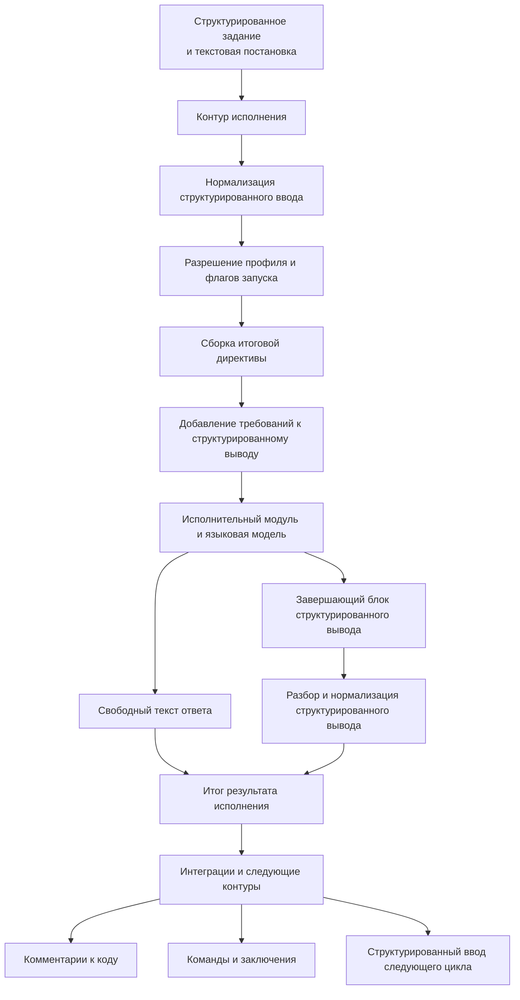

# Структурированный ввод и вывод контура исполнения

## 1. Назначение документа

Настоящий документ фиксирует роль структурированного ввода и структурированного вывода в контуре исполнения, правила их прохождения через вычислительный каскад и требования к расширяемости механизма.

Документ описывает не только формат обмена, но и архитектурную ответственность контура исполнения: именно он определяет, как структурированные данные задачи будут представлены языковой модели и как ответ модели будет возвращён в нормализованном виде.

## 2. Назначение структурированного ввода

Структурированный ввод нужен для передачи в контур исполнения полноценного контекста задачи, а не только краткой текстовой постановки.

В структурированном вводе могут находиться:

- постановка задачи;
- ограничения и инварианты;
- проектный и оперативный контекст;
- результаты предыдущих запусков;
- замечания ревью и ответы на них;
- сведения о требуемых интеграционных действиях;
- дополнительные поля, введённые конфигурационными расширениями.

В текущей реализации этот канонический `structured input` выражается через единый JSON-контракт верхнего уровня с полями `protocol_version`, `task`, `constraints`, `project_context`, `operational_context`, `previous_run_results`, `review_remarks`, `review_responses`, `integration_actions`, `extensions`.

Основная цель структурированного ввода состоит в том, чтобы контур исполнения мог собрать из него итоговую исполнительную директиву, достаточную для целевого вычислительного каскада.

## 3. Назначение структурированного вывода

Структурированный вывод нужен для возврата результата в виде, пригодном для дальнейшей автоматической обработки.

Основная цель структурированного вывода состоит в том, чтобы последующие контуры и интеграции не выполняли повторный смысловой разбор свободного текста, а работали с нормализованными полями результата.

Структурированный вывод может использоваться для:

- автоматического прикрепления замечаний ревью к коду;
- передачи исполнительному каскаду кодирования структурированного списка доработок;
- передачи ответов на комментарии;
- передачи команд следующему шагу, например на открытие запроса на слияние;
- передачи заключений о готовности результата или необходимости доработки.

В текущей реализации этот канонический `structured output` выражается через единый JSON-контракт верхнего уровня с полями `protocol_version`, `summary`, `commit_message`, `remarks`, `questions`, `follow_up_actions`, `changes`, `commands`, `conclusion`, `extensions`.

## 4. Ответственность контура исполнения

Контур исполнения отвечает за весь цикл работы со структурированным вводом и выводом.

В его обязанности входят:

- приём структурированного контекста задачи;
- нормализация входной структуры;
- выбор режима её учёта по параметрам конкретного запуска;
- сборка итоговой исполнительной директивы для исполнительного модуля и модели;
- добавление инструкций о требуемом структурированном выводе;
- выделение структурированного вывода из ответа исполнительного модуля;
- разбор и нормализация структурированного вывода;
- использование `commit_message` из канонического structured output как первого кандидата для git commit при включённом `commit-push`;
- возврат итогового текстового результата и структурированного результата дальше по цепочке.

Внешний инициатор задачи не обязан знать, в каком именно виде структурированный ввод и описание структурированного вывода должны попасть в исполнительную директиву. Это является обязанностью контура исполнения.

Контур исполнения сам добавляет инструкцию о trailing block `<progress-structured-output>...</progress-structured-output>` в итоговый prompt и сам извлекает завершающий блок из ответа вычислителя.

## 5. Поток данных

## 6. Порядок прохождения данных

Минимальный поток работы со структурированным вводом и выводом выглядит следующим образом:

1. контур исполнения принимает текстовую постановку и структурированный ввод;
2. структурированный ввод проходит единый канонический валидатор и нормализуется во внутреннюю модель; payload без содержательного контекста, например только с `protocol_version`, считается невалидным;
3. по параметрам запуска определяется, какие секции должны участвовать в исполнительной директиве;
4. контур исполнения собирает итоговую исполнительную директиву для исполнительного модуля;
5. если включён `structured output`, в директиву после текстовой части prompt добавляется инструкция о структуре ожидаемого структурированного вывода; при наличии программного structured input его блок дописывается после этой инструкции;
6. исполнительный модуль передаёт директиву вычислительному каскаду;
7. после ответа вычислителя контур исполнения отделяет свободный текст от структурированного вывода;
8. структурированный вывод разбирается и нормализуется;
9. при включённом `commit-push` git-стадия выбирает commit message в порядке `structured_output.commit_message -> Invocation.Workplace.Name -> basename(prepared workplace path) -> default`, пропуская пустые и whitespace-only значения;
10. итоговый текст и структурированные поля передаются в дальнейшую обработку.

## 7. Управление через профиль и флаги запуска

В текущей реализации structured input и structured output управляются только параметрами конкретного запуска:

- текстовым `prompt`;
- программным `LaunchSpec.StructuredInput`;
- флагом или полем `structured-output`;
- флагом или полем `structured-output-required`.

Исполнительный профиль сейчас не меняет structured input, structured output или правила сборки prompt. Профиль влияет только на выбор модели и git-поведение запуска.

## 8. Расширяемость через конфигурацию

Целевой механизм должен быть расширяемым через конфигурацию.

Это означает, что не должны быть жёстко зашиты только в коде:

- полная схема структурированного ввода;
- полная схема структурированного вывода;
- правила преобразования структурированного ввода в исполнительную директиву;
- набор допустимых команд, заключений и технических полей.

Для минимально разумной расширяемости канонический контракт уже сейчас использует два механизма:

- отдельные типы для повторяемых секций, например `remark`, `question`, `action`, `command`, `conclusion`;
- контейнер `extensions` на верхнем уровне `structured input` и `structured output`, в который можно добавлять новые ветви без перестройки базового механизма разбора.

Конфигурация должна позволять адаптировать механизм под разные режимы исполнения, например:

- ревизию;
- кодирование;
- ответ на замечания;
- верификацию;
- подготовку релизных и интеграционных действий.

## 9. Требования к отказоустойчивости

При работе со структурированным выводом контур исполнения должен соблюдать следующие правила:

1. свободный текст ответа не должен теряться даже при ошибке разбора структурированного вывода;
2. отсутствие структурированного вывода должно быть допустимым режимом, если он не был обязателен по профилю;
3. ошибка разбора структурированного вывода должна возвращаться как диагностируемое состояние;
4. интеграции и последующие контуры должны получать уже нормализованный результат, а не сырой ответ исполнительного модуля.
