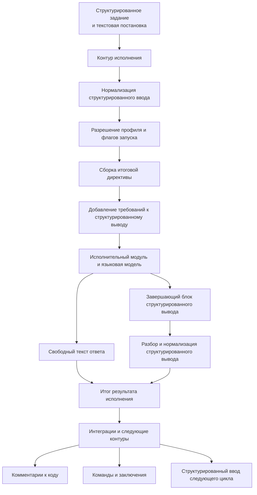

# Структурированный ввод и вывод контура исполнения

## 1. Назначение документа

Настоящий документ фиксирует роль структурированного ввода и структурированного вывода в контуре исполнения, правила их прохождения через вычислительный каскад и требования к расширяемости механизма.

Документ описывает не только формат обмена, но и архитектурную ответственность контура исполнения: именно он определяет, как структурированные данные задачи будут представлены языковой модели и как ответ модели будет возвращён в нормализованном виде.

## 2. Назначение структурированного ввода

Структурированный ввод нужен для передачи в контур исполнения полноценного контекста задачи, а не только краткой текстовой постановки.

В структурированном вводе могут находиться:

- постановка задачи;
- ограничения и инварианты;
- проектный и оперативный контекст;
- результаты предыдущих запусков;
- замечания ревизии и ответы на них;
- сведения о требуемых интеграционных действиях;
- дополнительные поля, введённые конфигурационными расширениями.

В текущей реализации этот канонический `structured input` выражается через единый JSON-контракт верхнего уровня с полями `task`, `constraints`, `project_context`, `operational_context`, `previous_run_results`, `review_remarks`, `review_responses`, `integration_actions`, `extensions`.

Основная цель структурированного ввода состоит в том, чтобы контур исполнения мог собрать из него итоговую исполнительную директиву, достаточную для целевого вычислительного каскада.

Для сценария возобновления сеанса исполнительного модуля используется тот же канонический контракт, но в компактном виде: исходная `task` и крупные секции родительского запуска не копируются повторно, новое указание передаётся через `operational_context[]`, компактная ссылка на родительский запуск фиксируется в `previous_run_results[]`, а служебные метаданные возобновления сохраняются в `extensions.resume`. Полный контекст предыдущей работы должен оставаться в состоянии самого исполнительного модуля, а не переотправляться через контур исполнения.

## 3. Назначение структурированного вывода

Структурированный вывод нужен для возврата результата в виде, пригодном для дальнейшей автоматической обработки.

Основная цель структурированного вывода состоит в том, чтобы последующие контуры и интеграции не выполняли повторный смысловой разбор свободного текста, а работали с нормализованными полями результата.

Структурированный вывод может использоваться для:

- автоматического прикрепления замечаний ревизии к коду;
- передачи исполнительному каскаду кодирования структурированного списка доработок;
- передачи ответов на комментарии;
- передачи команд следующему шагу, например на открытие запроса на слияние;
- передачи заключений о готовности результата или необходимости доработки.

В текущей реализации этот канонический `structured output` выражается через единый JSON-контракт верхнего уровня с полями `summary`, `commit_message`, `remarks`, `questions`, `follow_up_actions`, `changes`, `commands`, `conclusion`, `extensions`.

## 4. Ответственность контура исполнения

Контур исполнения отвечает за весь цикл работы со структурированным вводом и выводом.

В его обязанности входят:

- приём структурированного контекста задачи;
- нормализация входной структуры;
- выбор режима её учёта по параметрам конкретного запуска;
- сборка итоговой исполнительной директивы для исполнительного модуля и модели;
- добавление инструкций о требуемом структурированном выводе;
- выделение структурированного вывода из ответа исполнительного модуля;
- разбор и нормализация структурированного вывода;
- использование `commit_message` из канонического структурированного вывода как первого кандидата для сообщения коммита при включённом `commit-push`;
- возврат итогового текстового результата и структурированного результата дальше по цепочке.

Внешний инициатор задачи не обязан знать, в каком именно виде структурированный ввод и описание структурированного вывода должны попасть в исполнительную директиву. Это является обязанностью контура исполнения.

Контур исполнения сам добавляет инструкцию о завершающем блоке `<progress-structured-output>...</progress-structured-output>` в итоговую директиву и сам извлекает завершающий блок из ответа вычислителя.

## 5. Поток данных

## 6. Порядок прохождения данных

Минимальный поток работы со структурированным вводом и выводом выглядит следующим образом:

1. контур исполнения принимает структурированный ввод, собранный из `--input-file` и structured-input CLI-флагов либо переданный программно;
2. структурированный ввод проходит единый канонический валидатор и нормализуется во внутреннюю модель; payload без содержательного контекста, например пустой объект, считается невалидным;
3. по параметрам запуска определяется, какие секции должны участвовать в исполнительной директиве;
4. контур исполнения собирает итоговую исполнительную директиву для исполнительного модуля;
5. если профиль добавляет `prompt-additions`, они вставляются после задачи из структурированного ввода и до любых structured-инструкций;
6. если включён `structured output`, в директиву после задачи и дополнений профиля добавляется самодостаточная инструкция о структуре ожидаемого структурированного вывода: обязательный непустой `summary`, а также формы объектных секций и компактный канонический JSON-пример только для выбранных опциональных полей (`structured-output-fields`); структурированный ввод добавляется в директиву как JSON-контекст;
7. исполнительный модуль передаёт директиву вычислительному каскаду;
8. после ответа вычислителя контур исполнения отделяет свободный текст от структурированного вывода;
9. структурированный вывод разбирается и нормализуется;
10. при включённом `commit-push` git-стадия выбирает сообщение коммита в порядке `structured_output.commit_message -> Invocation.Workplace.Name -> basename(prepared workplace path) -> default`, пропуская пустые и whitespace-only значения;
11. после завершения запуска контур сохраняет локальную JSON-запись в `.progress/execution-runs/`, где фиксируются нормализованный `Invocation`, разрешённый профиль, выделение ресурсов, рабочее место, канонический структурированный ввод, сырой payload структурированного вывода, разобранный структурированный вывод и итоговый статус запуска;
12. итоговый текст и структурированные поля передаются в дальнейшую обработку.

Запись запуска является артефактом диагностики среды исполнения, а не частью результата задачи. Она создаётся для обычного `progress execution start`, прямого `progress execution launch` и внутренних запусков `progress execution review-cycle`, потому что все эти маршруты сходятся в одном модуле запуска. Если строгая валидация структурированного вывода завершилась ошибкой, запись всё равно сохраняет нормализованный вход, путь сырого вывода, найденный сырой structured payload и диагностическое поле ошибки. Ошибка записи самой записи запуска не должна валить основной запуск.

Для `progress execution resume` создаётся новая самостоятельная запись запуска. Родительская запись не изменяется. Связь хранится явно через `parent_run_id`, а при наличии внешнего идентификатора сеанса исполнительного модуля он фиксируется в поле `runner_session_id`.

Для `codex` идентификатор берётся из доверительного адаптерного канала `thread.started.thread_id` в JSON-событии `codex exec --json`; для `opencode` — из служебного списка сессий после запуска.

Контекстный архив также сохраняет краткое дополнительное сообщение возобновления и его источник (`message` или `message-file`).

Директории среды исполнения `.progress/runner-output/` и `.progress/execution-runs/` исключаются из автоматического `commit-push`, чтобы локальные диагностические файлы не попадали в ветки целевых репозиториев. Остальные проектные файлы `.progress`, например `.progress/execution/profiles.json`, остаются видимыми для git-стадии как обычные изменения.

## 7. Управление через профиль и флаги запуска

В текущей реализации структурированный ввод управляется параметрами полного маршрута, а структурированный вывод дополнительно может управляться исполнительным профилем:

- `--input-file` с JSON структурированного ввода;
- `--task`;
- повторяемым `--constraint`;
- повторяемыми JSON-object флагами `--project-context`, `--operational-context`, `--previous-run-result`, `--review-remark`, `--review-response`, `--integration-action`;
- `prompt-additions` из разрешённого профиля;
- программным `LaunchSpec.StructuredInput`;
- флагом или полем `structured-output`;
- флагом или полем `structured-output-required`;
- полями разрешённого профиля `structured-output`, `structured-output-required`, `structured-output-fields`.

Для `structured-output` и `structured-output-required` используется OR-семантика между конкретным запуском и разрешённым профилем. Если профиль включает `structured-output-required`, исполнительный модуль не только валидирует результат строже, но и сам добавляет инструкцию структурированного вывода в директиву даже без явного CLI-флага.

`--input-file` применяется первым. После этого scalar-флаги перезаписывают соответствующие поля, а repeated-флаги добавляют элементы к массивам. `extensions` на текущем этапе задаются только через файл.

Для `execution resume` CLI не принимает полный набор structured-input флагов. Вместо этого он строит компактный канонический `structured input` автоматически на основании родительской записи запуска и нового сообщения. Это гарантирует, что возобновление остаётся универсальным и не зависит от копирования полного исходного контекста в новый запуск.

Поле `prompt-additions` задаётся в `defaults` и/или конкретном профиле. В текущей реализации используется семантика объединения: дополнения из `defaults` идут первыми, дополнения конкретного профиля идут после них. Этот текст остаётся обычной текстовой частью исполнительной директивы и не смешивается с каноническим структурированным вводом.

Поле `structured-output-fields` задаётся только в профиле и влияет исключительно на инструкцию в директиве: оно определяет, какие дополнительные top-level canonical fields исполнительный модуль должен по возможности заполнить. Значение `summary` допускается для совместимости с контрактом issue #28, но остаётся обязательным и не делает поле настраиваемым. Канонический parser при этом не сужается и по-прежнему принимает любой валидный payload с дополнительными поддерживаемыми секциями.

Наглядный wrong-vs-right:

- wrong short form: `{"summary":"Done.","remarks":"fixed","conclusion":"ready"}`
- canonical form: `{"summary":"Done.","remarks":[{"title":"Fixed"}],"conclusion":{"status":"ok","summary":"Ready for review"}}`

## 8. Расширяемость через конфигурацию

Целевой механизм должен быть расширяемым через конфигурацию.

Это означает, что не должны быть жёстко зашиты только в коде:

- полная схема структурированного ввода;
- полная схема структурированного вывода;
- правила преобразования структурированного ввода в исполнительную директиву;
- набор допустимых команд, заключений и технических полей.

Для минимально разумной расширяемости канонический контракт уже сейчас использует два механизма:

- отдельные типы для повторяемых секций, например `remark`, `question`, `action`, `command`, `conclusion`;
- контейнер `extensions` на верхнем уровне структурированного ввода и структурированного вывода, в который можно добавлять новые ветви без перестройки базового механизма разбора.

Конфигурация должна позволять адаптировать механизм под разные режимы исполнения, например:

- ревизию;
- кодирование;
- ответ на замечания;
- верификацию;
- подготовку релизных и интеграционных действий.

## 9. Требования к отказоустойчивости

При работе со структурированным выводом контур исполнения должен соблюдать следующие правила:

1. свободный текст ответа не должен теряться даже при ошибке разбора структурированного вывода;
2. отсутствие структурированного вывода должно быть допустимым режимом, если он не был обязателен по профилю;
3. ошибка разбора структурированного вывода должна возвращаться как диагностируемое состояние;
4. ошибки type mismatch (`json.UnmarshalTypeError`) должны указывать путь поля и ожидаемый тип (`type mismatch at <field>: expected <type> but got <json-kind>`);
5. интеграции и последующие контуры должны получать уже нормализованный результат, а не сырой ответ исполнительного модуля.
