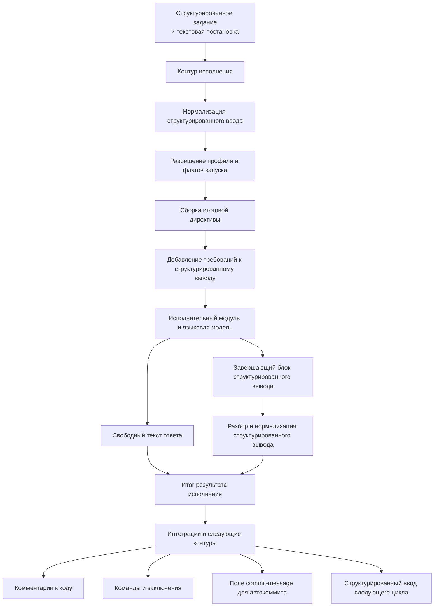

# Структурированный ввод и вывод контура исполнения

## 1. Назначение документа

Настоящий документ фиксирует роль структурированного ввода и структурированного вывода в контуре исполнения, правила их прохождения через вычислительный каскад и требования к расширяемости механизма.

Документ описывает не только формат обмена, но и архитектурную ответственность контура исполнения: именно он определяет, как структурированные данные задачи будут представлены языковой модели и как ответ модели будет возвращён в нормализованном виде.

## 2. Назначение структурированного ввода

Структурированный ввод нужен для передачи в контур исполнения полноценного контекста задачи, а не только краткой текстовой постановки.

В структурированном вводе могут находиться:

- постановка задачи;
- ограничения и инварианты;
- проектный и оперативный контекст;
- результаты предыдущих запусков;
- замечания ревью и ответы на них;
- сведения о требуемых интеграционных действиях;
- дополнительные поля, введённые конфигурационными расширениями.

Основная цель структурированного ввода состоит в том, чтобы контур исполнения мог собрать из него итоговую исполнительную директиву, достаточную для целевого вычислительного каскада.

## 3. Назначение структурированного вывода

Структурированный вывод нужен для возврата результата в виде, пригодном для дальнейшей автоматической обработки.

Основная цель структурированного вывода состоит в том, чтобы последующие контуры и интеграции не выполняли повторный смысловой разбор свободного текста, а работали с нормализованными полями результата.

Структурированный вывод может использоваться для:

- автоматического прикрепления замечаний ревью к коду;
- передачи исполнительному каскаду кодирования структурированного списка доработок;
- передачи ответов на комментарии;
- передачи команд следующему шагу, например на открытие запроса на слияние;
- передачи заключений о готовности результата или необходимости доработки;
- передачи поля `commit-message` для автоматического создания коммита.

Поле `commit-message` является одним из практически значимых результатов структурированного вывода, поскольку позволяет отделить содержательное резюме изменений от технического механизма автокоммита. Контур исполнения или интеграционный слой могут использовать этот ключ при включённом режиме автоматического `commit/push` либо проигнорировать его, если такой режим отключён.

## 4. Ответственность контура исполнения

Контур исполнения отвечает за весь цикл работы со структурированным вводом и выводом.

В его обязанности входят:

- приём структурированного контекста задачи;
- нормализация входной структуры;
- выбор режима её учёта по профилю и флагам запуска;
- сборка итоговой исполнительной директивы для исполнительного модуля и модели;
- добавление инструкций о требуемом структурированном выводе;
- выделение структурированного вывода из ответа исполнительного модуля;
- разбор и нормализация структурированного вывода;
- возврат итогового текстового результата и структурированного результата дальше по цепочке.

Внешний инициатор задачи не обязан знать, в каком именно виде структурированный ввод и описание структурированного вывода должны попасть в исполнительную директиву. Это является обязанностью контура исполнения.

## 5. Поток данных

## 6. Порядок прохождения данных

Минимальный поток работы со структурированным вводом и выводом выглядит следующим образом:

1. контур исполнения принимает текстовую постановку и структурированный ввод;
2. структурированный ввод нормализуется во внутреннюю каноническую модель;
3. по активному профилю и флагам запуска определяется, какие секции должны участвовать в исполнительной директиве;
4. контур исполнения собирает итоговую исполнительную директиву для исполнительного модуля;
5. при необходимости в директиву добавляется инструкция о структуре ожидаемого структурированного вывода;
6. исполнительный модуль передаёт директиву вычислительному каскаду;
7. после ответа вычислителя контур исполнения отделяет свободный текст от структурированного вывода;
8. структурированный вывод разбирается и нормализуется;
9. итоговый текст и структурированные поля передаются в дальнейшую обработку.

## 7. Управление через профиль и флаги запуска

Управлять структурированным вводом и выводом нужно уметь двумя способами:

- через исполнительный профиль;
- через явные флаги конкретного запуска.

Профиль задаёт поведение по умолчанию. Явные флаги имеют приоритет и позволяют переопределить это поведение для конкретного запуска.

В минимальном виде профиль может управлять:

- включением или отключением учёта структурированного ввода;
- включением или отключением запроса структурированного вывода;
- способом включения структурированного ввода в исполнительную директиву;
- используемой схемой структурированного вывода;
- допустимыми типами команд и заключений в структурированном выводе.

## 8. Расширяемость через конфигурацию

Целевой механизм должен быть расширяемым через конфигурацию.

Это означает, что не должны быть жёстко зашиты только в коде:

- полная схема структурированного ввода;
- полная схема структурированного вывода;
- правила преобразования структурированного ввода в исполнительную директиву;
- набор допустимых команд, заключений и технических полей, включая поле `commit-message`.

Конфигурация должна позволять адаптировать механизм под разные режимы исполнения, например:

- ревизию;
- кодирование;
- ответ на замечания;
- верификацию;
- подготовку релизных и интеграционных действий.

## 9. Требования к отказоустойчивости

При работе со структурированным выводом контур исполнения должен соблюдать следующие правила:

1. свободный текст ответа не должен теряться даже при ошибке разбора структурированного вывода;
2. отсутствие структурированного вывода должно быть допустимым режимом, если он не был обязателен по профилю;
3. ошибка разбора структурированного вывода должна возвращаться как диагностируемое состояние;
4. невалидное поле `commit-message` не должно ломать весь результат исполнения, если остальной структурированный вывод разобран успешно;
5. интеграции и последующие контуры должны получать уже нормализованный результат, а не сырой ответ исполнительного модуля.
