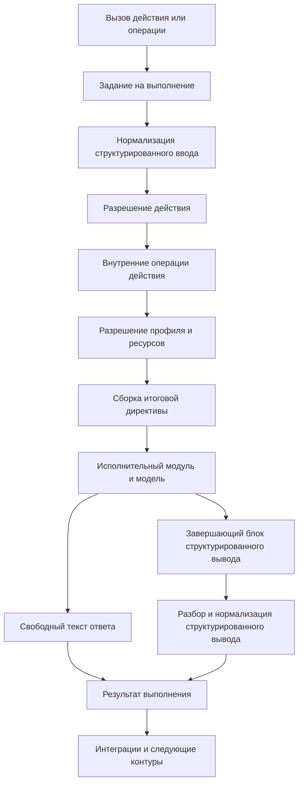

# Структурированный ввод и вывод контура исполнения

## 1. Назначение документа

Настоящий документ фиксирует роль структурированного ввода и структурированного вывода в контуре исполнения, правила их прохождения через вычислительный каскад и требования к расширяемости механизма.

Документ описывает не только формат обмена, но и архитектурную ответственность контура исполнения: именно он определяет, как структурированные данные задачи будут представлены исполнительному модулю и как результат будет возвращён в нормализованном виде.

## 2. Назначение структурированного ввода

Структурированный ввод нужен для передачи в контур исполнения полноценного контекста задачи, а не только краткой текстовой постановки.

В структурированном вводе могут находиться:

- постановка задачи;
- ограничения и инварианты;
- проектный и оперативный контекст;
- результаты предыдущих запусков;
- замечания ревизии и ответы на них;
- сведения о требуемых интеграционных действиях;
- дополнительные поля, введённые конфигурационными расширениями.

В текущей реализации канонический структурированный ввод выражается через JSON-контракт верхнего уровня с полями `task`, `constraints`, `project_context`, `operational_context`, `previous_run_results`, `review_remarks`, `review_responses`, `integration_actions`, `extensions`.

Основная цель структурированного ввода состоит в том, чтобы контур исполнения мог собрать из него итоговую исполнительную директиву, достаточную для целевого вычислительного каскада.

## 3. Назначение структурированного вывода

Структурированный вывод нужен для возврата результата в виде, пригодном для дальнейшей автоматической обработки.

Основная цель структурированного вывода состоит в том, чтобы последующие контуры и интеграции не выполняли повторный смысловой разбор свободного текста, а работали с нормализованными полями результата.

Структурированный вывод может использоваться для:

- автоматического прикрепления замечаний ревизии к коду;
- передачи исполнительному каскаду кодирования структурированного списка доработок;
- передачи ответов на замечания ревизии;
- передачи команд следующему шагу, например на открытие запроса на слияние;
- передачи заключений о готовности результата или необходимости доработки.

В текущей реализации канонический структурированный вывод выражается через JSON-контракт верхнего уровня с полями `summary`, `commit_message`, `remarks`, `review_responses`, `questions`, `follow_up_actions`, `changes`, `commands`, `conclusion`, `extensions`.

Ответ на замечание в `review_responses` может содержать поле `type`: значение `inline` требует `thread_id`, публикует ответ в цепочку и закрывает её при разрешённом состоянии; значение `comment` публикует новый связанный комментарий без закрытия цепочки; значение `local` сохраняет ответ только в результате и не вызывает внешний контур. Для `remark_id` следует возвращать устойчивое поле `id` из канонического замечания; внешний `external_id` сохраняется в том же замечании для интеграционного контура. Если `type` не задан, он восстанавливается по каноническому замечанию с указанным `remark_id`; заполненный `thread_id` без другого вида также означает `inline`. Если соответствие отсутствует или неоднозначно либо вид невозможно восстановить, ответ отклоняется без внешнего побочного эффекта.

Элементы `remarks` поддерживают привязку к строке diff через поля `path`, `line` и `side`. Поле `id` идентифицирует замечание текущей ревизии и является идентификатором, который нужно возвращать в `review_responses.remark_id`. Для продолжения или повторного открытия замечания предыдущего цикла используются отдельные поля `external_id` и `thread_id`; они не заменяют `id`. Если проектный идентификатор из текста замечания неоднозначен либо пересекается с внешним идентификатором другого замечания, исполнительный контур передаёт отдельный устойчивый идентификатор вида `remark-ref:<external_id>`. Это целевой контракт: каноническое поле `external_id` сохраняется для обратной совместимости с ответами, сформированными по внешнему идентификатору. Если для замечания заданы `path` и `line`, операция `publish-review-remarks` передаёт эти поля в контур интеграции и публикует замечание как inline-комментарий. Если `side` не задан, используется значение `RIGHT`. Поле `line` должно указывать строку diff на выбранной стороне, а не произвольную строку файла вне изменения. Если `path` или `line` отсутствуют, замечание публикуется как общий комментарий к запросу на слияние.

## 4. Ответственность контура исполнения

Контур исполнения отвечает за весь цикл работы со структурированным вводом и выводом.

В его обязанности входят:

- приём задания на выполнение через вызов действия или вызов операции;
- нормализация входной структуры;
- разрешение действия и списка операций текущего запуска;
- внутреннее разрешение исполнительного профиля, ресурсов и рабочего места;
- сборка итоговой исполнительной директивы для исполнительного модуля и модели;
- добавление инструкций о требуемом структурированном выводе;
- выделение структурированного вывода из ответа исполнительного модуля;
- разбор и нормализация структурированного вывода;
- использование `commit_message` из канонического структурированного вывода как первого кандидата для сообщения коммита при выполнении операции `commit-push`;
- возврат итогового текстового результата и структурированного результата дальше по цепочке.

Внешний инициатор задачи не обязан знать, в каком именно виде структурированный ввод и описание структурированного вывода должны попасть в исполнительную директиву. Это является обязанностью контура исполнения.

Контур исполнения сам добавляет инструкцию о завершающем блоке `<progress-structured-output>...</progress-structured-output>` в итоговую директиву и сам извлекает завершающий блок из ответа вычислителя.

## 5. Поток данных

## 6. Порядок прохождения данных

Минимальный поток работы со структурированным вводом и выводом выглядит следующим образом:

1. контур исполнения принимает `ActionInvocation` или `OperationInvocation`;
2. задание на выполнение `ExecutionAssignment` передаёт действие, каноническую задачу, ограничения, основания выбора и, при наличии, структурированный ввод;
3. если структурированный ввод передан, он проходит единый канонический валидатор и нормализуется во внутреннюю модель;
4. явно переданный payload без содержательного контекста, например пустой объект, считается невалидным;
5. контур разрешает действие и фиксирует список операций текущего запуска;
6. если действие требует синтеза, контур внутренне разрешает профиль, ресурсы и рабочее место;
7. если профиль добавляет `prompt-additions`, они вставляются после задачи из структурированного ввода и до инструкций структурированного вывода;
8. если разрешённый профиль требует структурированный вывод, в директиву добавляется самодостаточная инструкция о структуре ожидаемого результата: обязательный непустой `summary`, формы объектных секций и компактный канонический JSON-пример только для выбранных опциональных полей `structured-output-fields`;
9. если структурированный ввод присутствует, он добавляется в директиву как JSON-контекст;
10. исполнительный модуль передаёт директиву вычислительному каскаду;
11. после ответа вычислителя контур исполнения отделяет свободный текст от структурированного вывода;
12. структурированный вывод разбирается и нормализуется;
13. при выполнении операции `commit-push` git-стадия выбирает сообщение коммита в порядке `structured_output.commit_message -> имя рабочего места -> имя каталога рабочего места -> значение по умолчанию`, пропуская пустые значения;
14. после завершения запуска контур сохраняет локальную JSON-запись в `.progress/execution-runs/`, где фиксируются рабочее представление вызова, разрешённый профиль, выделение ресурсов, рабочее место, канонический структурированный ввод, сырой payload структурированного вывода, разобранный структурированный вывод и итоговый статус запуска;
15. итоговый текст и структурированные поля передаются в дальнейшую обработку.

Запись запуска является артефактом диагностики среды исполнения, а не частью результата задачи. Если строгая валидация структурированного вывода завершилась ошибкой, запись всё равно сохраняет нормализованный вход, путь сырого вывода, найденный сырой payload и диагностическое поле ошибки. Ошибка записи самой записи запуска не должна валить основной запуск.

Директории среды исполнения `.progress/runner-output/` и `.progress/execution-runs/` исключаются из git-стадии `commit-push`, чтобы локальные диагностические файлы не попадали в ветки целевых репозиториев. Остальные проектные файлы `.progress`, например `.progress/execution/profiles.json`, остаются видимыми для git-стадии как обычные изменения.

Идентичность автора и коммиттера, параметры подписи и SSH-ключ отправки ветки не передаются в исполнительную директиву и не берутся из структурированного ввода. Операция `commit-push` получает их из объединённого снимка `resources.json` и применяет только к локальным процессам `git commit` и `git push`.

## 7. Управление структурой через действие и профиль

Внешний вызов управляет структурированным вводом, но не параметрами внутренних стадий.

Через CLI структурированный ввод задаётся:

- `--input-file` с JSON структурированного ввода;
- `--task`;
- повторяемым `--constraint`;
- повторяемыми JSON-объектными флагами `--project-context`, `--operational-context`, `--previous-run-result`, `--review-remark`, `--review-response`, `--integration-action`;
- флагами внешнего контекста `--repository`, `--task-number`, `--pr-number`, `--base`, `--head`, `--title`, `--body`, `--draft`, которые CLI преобразует в `ExecutionAssignment.CanonicalTask` и `ExecutionAssignment.RelatedObjects`.

Если structured-флаги и `--input-file` не переданы, вызов не содержит структурированного ввода. `--input-file` применяется первым. После этого scalar-флаги перезаписывают соответствующие поля, а repeated-флаги добавляют элементы к массивам. `extensions` на текущем этапе задаётся только через файл.

Структурированный вывод управляется не внешними флагами запуска, а разрешённым действием и исполнительным профилем. Профиль может включать:

- `prompt-additions`;
- `structured-output`;
- `structured-output-required`;
- `structured-output-fields`.

Поле `prompt-additions` задаётся в `defaults` и/или конкретном профиле. В текущей реализации используется семантика объединения: дополнения из `defaults` идут первыми, дополнения конкретного профиля идут после них. Этот текст остаётся обычной текстовой частью исполнительной директивы и не смешивается с каноническим структурированным вводом.

Поле `structured-output-fields` задаётся в профиле и влияет только на инструкцию в директиве: оно определяет, какие дополнительные верхнеуровневые канонические поля исполнительный модуль должен по возможности заполнить. Значение `summary` допускается для совместимости с прежним контрактом, но остаётся обязательным и не делает поле настраиваемым. Канонический разбор при этом не сужается и по-прежнему принимает любой валидный JSON с дополнительными поддерживаемыми секциями.

Наглядное сопоставление ошибочной и канонической формы:

- wrong short form: `{"summary":"Done.","remarks":"fixed","conclusion":"ready"}`
- canonical form: `{"summary":"Done.","remarks":[{"title":"Fixed","path":"internal/service.go","line":42,"side":"RIGHT"}],"conclusion":{"status":"ok","summary":"Ready for review"}}`

## 8. Расширяемость через конфигурацию

Целевой механизм должен быть расширяемым через конфигурацию.

Это означает, что не должны быть жёстко зашиты только в коде:

- полная схема структурированного ввода;
- полная схема структурированного вывода;
- правила преобразования структурированного ввода в исполнительную директиву;
- набор допустимых команд, заключений и технических полей.

Для минимально разумной расширяемости канонический контракт уже сейчас использует два механизма:

- отдельные типы для повторяемых секций, например `remark`, `question`, `action`, `command`, `conclusion`;
- контейнер `extensions` на верхнем уровне структурированного ввода и структурированного вывода, в который можно добавлять новые ветви без перестройки базового механизма разбора.

Конфигурация должна позволять адаптировать механизм под разные действия, например:

- ревизию;
- инженерный синтез;
- ответ на замечания;
- верификацию;
- подготовку релизных и интеграционных действий.

## 9. Требования к отказоустойчивости

При работе со структурированным выводом контур исполнения должен соблюдать следующие правила:

1. свободный текст ответа не должен теряться даже при ошибке разбора структурированного вывода;
2. отсутствие структурированного вывода должно быть допустимым режимом, если он не был обязателен по разрешённому профилю;
3. ошибка разбора структурированного вывода должна возвращаться как диагностируемое состояние;
4. ошибки type mismatch (`json.UnmarshalTypeError`) должны указывать путь поля и ожидаемый тип (`type mismatch at <field>: expected <type> but got <json-kind>`);
5. интеграции и последующие контуры должны получать уже нормализованный результат, а не сырой ответ исполнительного модуля.
