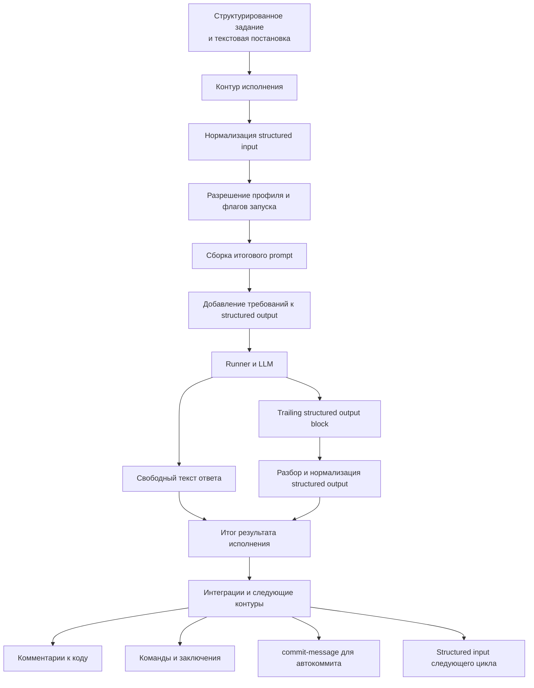

# Structured input и output контура исполнения

## 1. Назначение документа

Настоящий документ фиксирует роль structured input и structured output в контуре исполнения, правила их прохождения через вычислительный каскад и требования к расширяемости механизма.

Документ описывает не только формат обмена, но и архитектурную ответственность контура исполнения: именно он определяет, как структурированные данные задачи будут представлены языковой модели и как ответ модели будет возвращён в нормализованном виде.

## 2. Назначение structured input

Structured input нужен для передачи в контур исполнения полноценного контекста задачи, а не только краткой текстовой постановки.

В structured input могут находиться:

- постановка задачи;
- ограничения и инварианты;
- проектный и оперативный контекст;
- результаты предыдущих запусков;
- замечания ревью и ответы на них;
- сведения о требуемых интеграционных действиях;
- дополнительные поля, введённые конфигурационными расширениями.

Основная цель structured input состоит в том, чтобы контур исполнения мог собрать из него итоговый prompt, достаточный для целевого вычислительного каскада.

## 3. Назначение structured output

Structured output нужен для возврата результата в виде, пригодном для дальнейшей автоматической обработки.

Основная цель structured output состоит в том, чтобы последующие контуры и интеграции не выполняли повторный смысловой разбор свободного текста, а работали с нормализованными полями результата.

Structured output может использоваться для:

- автоматического прикрепления замечаний ревью к коду;
- передачи coder-каскаду структурированного списка доработок;
- передачи ответов на комментарии;
- передачи команд следующему шагу, например на открытие pull request;
- передачи заключений о готовности результата или необходимости доработки;
- передачи `commit-message` для автоматического создания коммита.

`commit-message` является одним из практически значимых результатов structured output, поскольку позволяет отделить содержательное резюме изменений от технического механизма автокоммита. Контур исполнения или интеграционный слой могут использовать этот ключ при включённом режиме автоматического commit/push либо проигнорировать его, если такой режим отключён.

## 4. Ответственность контура исполнения

Контур исполнения отвечает за весь цикл работы со structured input и output.

В его обязанности входят:

- приём структурированного контекста задачи;
- нормализация входной структуры;
- выбор режима её учёта по профилю и флагам запуска;
- сборка итогового prompt для runner и модели;
- добавление инструкций о требуемом structured output;
- выделение structured output из ответа runner;
- разбор и нормализация structured output;
- возврат итогового текстового результата и структурированного результата дальше по цепочке.

Внешний инициатор задачи не обязан знать, в каком именно виде structured input и описание structured output должны попасть в prompt. Это является обязанностью контура исполнения.

## 5. Поток данных

## 6. Порядок прохождения данных

Минимальный поток работы со structured input и output выглядит следующим образом:

1. контур исполнения принимает текстовую постановку и structured input;
2. structured input нормализуется во внутреннюю каноническую модель;
3. по активному профилю и флагам запуска определяется, какие секции должны участвовать в prompt;
4. контур исполнения собирает итоговый prompt для runner;
5. при необходимости в prompt добавляется инструкция о структуре ожидаемого structured output;
6. runner передаёт prompt вычислительному каскаду;
7. после ответа вычислителя контур исполнения отделяет свободный текст от structured output;
8. structured output разбирается и нормализуется;
9. итоговый текст и структурированные поля передаются в дальнейшую обработку.

## 7. Управление через профиль и флаги запуска

Управлять structured input и output нужно уметь двумя способами:

- через execution profile;
- через явные флаги конкретного запуска.

Профиль задаёт поведение по умолчанию. Явные флаги имеют приоритет и позволяют переопределить это поведение для конкретного запуска.

В минимальном виде профиль может управлять:

- включением или отключением учёта structured input;
- включением или отключением запроса structured output;
- способом включения structured input в prompt;
- используемой схемой structured output;
- допустимыми типами команд и заключений в structured output.

## 8. Расширяемость через конфигурацию

Целевой механизм должен быть расширяемым через конфигурацию.

Это означает, что не должны быть жёстко зашиты только в коде:

- полная схема structured input;
- полная схема structured output;
- правила преобразования structured input в prompt;
- набор допустимых команд, заключений и технических полей, включая `commit-message`.

Конфигурация должна позволять адаптировать механизм под разные режимы исполнения, например:

- review;
- coding;
- reply to review;
- verification;
- подготовку релизных и интеграционных действий.

## 9. Требования к отказоустойчивости

При работе со structured output контур исполнения должен соблюдать следующие правила:

1. свободный текст ответа не должен теряться даже при ошибке разбора structured output;
2. отсутствие structured output должно быть допустимым режимом, если он не был обязателен по профилю;
3. ошибка разбора structured output должна возвращаться как диагностируемое состояние;
4. невалидный `commit-message` не должен ломать весь результат исполнения, если остальной structured output разобран успешно;
5. интеграции и последующие контуры должны получать уже нормализованный результат, а не сырой ответ runner.
