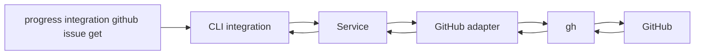
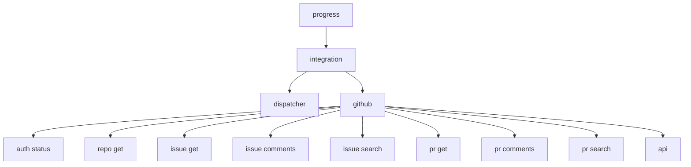

# CLI контура интеграции

## 1. Назначение документа

Настоящий документ определяет первый практический срез контура интеграции с внешними системами. На данном этапе контур получает первый рабочий адаптер трекера GitHub, использующий утилиту `gh` как штатный канал доступа к данным.

Документ фиксирует:

- модель работы интеграционного слоя;
- границы ответственности между CLI, сервисом интеграции и `gh`;
- состав пользовательских команд;
- этапы реализации первого адаптера.

## 2. Принцип интеграции через `gh`

В начальной реализации не требуется самостоятельный GitHub-клиент на Go. Вместо этого интеграционный модуль запускает `gh` как внешний инструмент и получает структурированный результат.

Базовая схема вызова:

1. CLI принимает входной запрос пользователя или другого контура;
2. сервис интеграции формирует внутренний `IntegrationRequest`;
3. GitHub-адаптер преобразует запрос в вызов `gh`;
4. `gh` выполняет авторизованный запрос к GitHub;
5. адаптер считывает `stdout` и `stderr`;
6. JSON-ответ преобразуется во внутреннюю нормализованную структуру;
7. CLI печатает результат в диагностическом или структурированном виде.



## 3. Причины выбора `gh`

На первом этапе такой подход предпочтителен по следующим причинам:

- не требуется отдельно реализовывать OAuth, PAT и хранение секретов;
- можно опереться на уже существующую авторизацию пользователя в `gh auth login`;
- `gh` уже покрывает типовые GitHub-сущности: `issue`, `pull request`, `comments`, `search`, `repo`, `api`;
- интеграция может начать работать как тонкий адаптер без преждевременного усложнения кодовой базы.

Ограничения такого подхода:

- требуется установленный бинарь `gh`;
- часть ошибок приходит как текст из `stderr` и должна быть нормализована;
- доступные операции ограничены возможностями установленной версии `gh`.

## 4. Внутренние модули реализации

Минимальный состав кода для первого этапа:

- `internal/integration/service.go` — фасад контура интеграции;
- `internal/integration/model/types.go` — типы запросов и нормализованных ответов;
- `internal/integration/github/service.go` — адаптер GitHub;
- `internal/integration/github/runner.go` — безопасный запуск `gh`;
- `internal/cli/integration.go` — ветка CLI-команд `progress integration ...`.

Минимальные внутренние интерфейсы:

```go
type Query struct {
    System string
    Kind   string
    Repo   string
    ID     string
    Search string
}

type Provider interface {
    Execute(context.Context, Query) (Result, error)
}
```

На первом этапе достаточно одного `Provider` для GitHub, но диспетчер должен сразу закладываться как расширяемый по имени системы.

## 5. Нормализованные сущности

Чтобы не распространять GitHub-специфику по другим контурам, вводятся внутренние сущности:

- `TrackerIssue`;
- `TrackerPullRequest`;
- `TrackerComment`;
- `TrackerReview`;
- `TrackerRepository`;
- `TrackerUser`;
- `TrackerSearchResult`.

Минимальные поля `TrackerIssue`:

- `System`;
- `Repository`;
- `Number`;
- `Title`;
- `Body`;
- `State`;
- `Labels`;
- `Assignees`;
- `Author`;
- `URL`;
- `CreatedAt`;
- `UpdatedAt`.

Минимальные поля `TrackerPullRequest`:

- `System`;
- `Repository`;
- `Number`;
- `Title`;
- `Body`;
- `State`;
- `Author`;
- `ReviewDecision`;
- `BaseRef`;
- `HeadRef`;
- `Labels`;
- `URL`;
- `CreatedAt`;
- `UpdatedAt`.

## 6. Состав CLI-команд

В минимальной конфигурации предусматриваются следующие команды:

- `progress integration dispatcher`;
- `progress integration github auth status`;
- `progress integration github repo get`;
- `progress integration github issue get`;
- `progress integration github issue comments`;
- `progress integration github issue search`;
- `progress integration github pr get`;
- `progress integration github pr comments`;
- `progress integration github pr search`;
- `progress integration github api`.

## 7. Назначение команд

### 7.1 `progress integration dispatcher`

Команда вызывает диспетчер интеграционного контура как отдельный модуль. Она нужна для диагностики маршрута: какой адаптер будет выбран, какие требования к доступу предъявляются и какой тип нормализованного объекта ожидается на выходе.

### 7.2 `progress integration github auth status`

Команда проверяет, доступен ли `gh` и авторизован ли пользователь.

Базовый системный вызов:

```bash
gh auth status
```

Назначение команды:

1. проверить наличие `gh` в `PATH`;
2. убедиться, что для GitHub выполнена авторизация;
3. вернуть диагностируемую ошибку, если дальнейшие вызовы невозможны.

### 7.3 `progress integration github repo get`

Команда получает сведения о репозитории по `owner/name`.

Предпочтительный вызов:

```bash
gh repo view owner/name --json name,owner,description,defaultBranchRef,url
```

Возвращаемые сведения используются как базовый контекст для последующих вызовов задач и запросов на слияние.

### 7.4 `progress integration github issue get`

Команда получает одну карточку issue по номеру и репозиторию.

Предпочтительный вызов:

```bash
gh issue view 123 --repo owner/name --json number,title,body,state,labels,assignees,author,url,createdAt,updatedAt
```

Назначение команды:

1. извлечь нормализованное представление задачи;
2. дать контуру принятия решения исходную карточку задачи;
3. поддержать прямую диагностику интеграции через CLI.

### 7.5 `progress integration github issue comments`

Команда получает комментарии issue.

Вариант через `gh api`:

```bash
gh api --paginate --slurp repos/owner/name/issues/123/comments
```

Команда принимает `--repo` и обязательный `--number`. Если `--repo` не передан, адаптер может использовать `default_repo` из `.progress/integration/systems.json` или глобального `$PROGRESS_CONFIG_HOME/integration/systems.json`; если пользователь явно передал пустой `--repo=`, резервный выбор не применяется и запрос отклоняется как `invalid-request`.

Адаптер преобразует paginated REST-ответ GitHub в массив `TrackerComment` с полями `System`, `Repository`, `Number`, `Author`, `Body`, `URL`, `CreatedAt` и `UpdatedAt`. В текстовом выводе команда печатает общий `comment_count`, затем поля каждого комментария и тело построчно.

### 7.6 `progress integration github issue search`

Команда выполняет поиск issue в репозитории или во всём доступном GitHub-пространстве.

Вариант вызова:

```bash
gh issue list --repo owner/name --search "is:open label:bug" --json number,title,state,labels,assignees,url,updatedAt
```

Команда должна поддерживать:

- фильтр по репозиторию;
- строку поиска GitHub;
- ограничение количества результатов;
- режим краткого и подробного вывода.

### 7.7 `progress integration github pr get`

Команда получает одну карточку запроса на слияние.

Предпочтительный вызов:

```bash
gh pr view 456 --repo owner/name --json number,title,body,state,author,labels,reviewDecision,baseRefName,headRefName,url,createdAt,updatedAt
```

Результат должен использоваться как нормализованная карточка запроса на слияние.

### 7.8 `progress integration github pr comments`

Команда получает комментарии запроса на слияние, включая замечания ревизии.

Для первого этапа допустимы два режима:

1. обычные комментарии issue-части PR;
2. замечания ревизии по diff.

Предпочтительные вызовы:

```bash
gh api repos/owner/name/issues/456/comments
gh api repos/owner/name/pulls/456/comments
```

Адаптер должен различать комментарии обсуждения и inline-замечания ревизии, но приводить их к совместимой внутренней схеме.

### 7.9 `progress integration github pr search`

Команда выполняет поиск запросов на слияние по фильтрам GitHub.

Вариант вызова:

```bash
gh pr list --repo owner/name --search "is:open review-requested:@me" --json number,title,state,author,reviewDecision,url,updatedAt
```

### 7.10 `progress integration github api`

Команда даёт управляемый escape hatch для редких операций, которые ещё не вынесены в отдельный подкомандный интерфейс.

Пример вызова:

```bash
progress integration github api repos/owner/name/issues/123/events
```

Ограничение команды состоит в том, что она не должна становиться основным пользовательским интерфейсом контура. Её задача - ускорить расширение адаптера без немедленного разрастания CLI-дерева.

## 8. Схема дерева команд



## 9. Общие флаги и правила вызова

Для унификации вызовов целесообразно ввести общие флаги:

- `--repo` — репозиторий `owner/name`;
- `--number` — номер issue или PR;
- `--query` — поисковая строка;
- `--limit` — ограничение числа результатов;
- `--format` — `text` или `json`;
- `--jq` или внутренний фильтр, если позже потребуется пользовательская фильтрация результата.

Базовые правила:

1. если операция требует репозиторий, `--repo` обязателен, кроме `github repo get`, `github issue get` и `github pr get`, где можно опустить `--repo` и использовать `default_repo` из конфигурации;
2. если операция адресует сущность по номеру, `--number` обязателен;
3. для машинного использования предпочтителен `--format json`;
4. текстовый вывод нужен для ручной диагностики и первичного освоения CLI.

## 10. Обработка ошибок

GitHub-адаптер должен различать как минимум следующие классы ошибок:

- `gh` не установлен;
- `gh` не авторизован;
- репозиторий не найден;
- issue или PR не найден;
- доступ запрещён;
- превышен rate limit;
- формат ответа неожиданно изменился;
- внешний вызов завершился по таймауту.

Для других контуров ошибка должна возвращаться не как сырая строка `stderr`, а как структурированное состояние с признаком:

- `temporary-unavailable`;
- `auth-required`;
- `not-found`;
- `invalid-request`;
- `internal-integration-error`.

## 11. Конфигурация

Контур интеграции использует двухслойную конфигурацию систем:

1. глобальный слой `$PROGRESS_CONFIG_HOME/integration/systems.json` или `~/.config/progress/integration/systems.json`;
2. локальный слой `.progress/integration/systems.json`.

Локальный слой имеет приоритет над глобальным:

1. `default_system` полностью заменяет глобальное значение;
2. `systems.<name>` дополняет или переопределяет одноимённую систему из глобального слоя;
3. простые поля системы, например `command`, `path`, `timeout`, `repository`, `project` и `default_repo`, заменяются локальными значениями;
4. `operations` сливается по ключу операции;
5. `enabled=false` в локальном слое выключает систему целиком.

Минимальная конфигурация GitHub-адаптера может выглядеть так:

```json
{
  "default_system": "github",
  "systems": {
    "github": {
      "type": "github",
      "enabled": true,
      "command": "gh",
      "timeout": "30s",
      "repository": "owner/name",
      "default_repo": "owner/name"
    }
  }
}
```

Назначение полей GitHub-системы:

1. `type` фиксирует тип адаптера и должен быть равен `github`, если требуется штатный GitHub-модуль текущей сборки;
2. `enabled` включает или выключает систему без удаления её описания;
3. `command` и `path` позволяют переопределить исполняемый файл `gh`;
4. `timeout` ограничивает внешний вызов;
5. `repository` задаёт проектный GitHub-репозиторий в формате `owner/name` и используется как основной резервный репозиторий для вызовов без `--repo`;
6. `project` резервирует идентификатор внешнего проекта для script-адаптеров и следующих этапов расширения;
7. `default_repo` сохраняется для переходного периода как совместимое имя того же резервного GitHub-репозитория;
8. `operations` резервирует пространство для дальнейшей пооперационной настройки, включая будущие script-адаптеры.

Правило приоритета `--repo`, `repository` и `default_repo`:

1. если `--repo` не передан, сервис использует `repository`, а при его отсутствии может использовать `default_repo`;
2. если `--repo` передан с непустым значением, используется именно это значение;
3. если `--repo` передан явно пустым (`--repo=`), запрос отклоняется как `invalid-request`, резервный выбор через `repository` и `default_repo` не применяется.

Для переходного периода сохраняется совместимость с локальным файлом `.progress/integration/github.json`, если новый `systems.json` отсутствует. Новый конфигурационный слой считается приоритетным и должен использоваться как основной.

## 12. Порядок реализации

### 12.1 Этап 1. Каркас контура

Минимальные работы:

1. ввести ветку `progress integration`;
2. ввести `internal/integration/service.go`;
3. определить модели запросов и ответов;
4. добавить команду `progress integration dispatcher`.

Результат этапа: кодовая база получает самостоятельный каркас контура интеграции, согласованный с общей архитектурой проекта.

### 12.2 Этап 2. Интеграция с `gh`

Минимальные работы:

1. реализовать раннер внешней команды `gh`;
2. добавить проверку `gh auth status`;
3. ввести конфигурацию таймаута и пути к бинарю;
4. унифицировать чтение `stdout` и `stderr`.

Результат этапа: адаптер может надёжно выполнять внешние вызовы и возвращать диагностируемые ошибки.

### 12.3 Этап 3. Чтение сущностей GitHub

Минимальные работы:

1. реализовать `repo get`;
2. реализовать `issue get` и `issue comments`;
3. реализовать `pr get` и `pr comments`;
4. добавить нормализаторы `TrackerIssue`, `TrackerPullRequest`, `TrackerComment`.

Результат этапа: контур способен получать основные объекты трекера в стабильном внутреннем формате.

### 12.4 Этап 4. Поиск и выборки

Минимальные работы:

1. реализовать `issue search`;
2. реализовать `pr search`;
3. ввести лимиты и базовое кэширование;
4. добавить текстовый и JSON-режимы вывода.

Результат этапа: контур способен не только читать карточки по номеру, но и строить выборки для принятия решения.

### 12.5 Этап 5. Расширение командного набора

Следующими кандидатами на добавление являются:

- `progress integration github pr diff`;
- `progress integration github pr checks`;
- `progress integration github issue create`;
- `progress integration github pr create`;
- `progress integration github repo branches`.

На этом этапе контур начинает переходить от чтения к управляемым операциям изменения состояния, но только после того, как чтение и диагностика стабилизированы.

## 13. Принципы проектирования

Для начальной реализации принимаются следующие правила:

1. другие контуры не должны знать синтаксис `gh`;
2. все вызовы `gh` должны быть сосредоточены в GitHub-адаптере;
3. в машинных сценариях нужно предпочитать JSON-режимы `gh`;
4. ошибки внешнего инструмента должны нормализоваться во внутреннюю модель отказа;
5. первый этап ограничивается чтением и поиском, а не мутацией данных в GitHub;
6. расширение на другие трекеры должно происходить через тот же контракт `Provider`, а не через ветвление по всей кодовой базе.

## 14. Ближайший практический приоритет

Первый рабочий срез GitHub-интеграции рекомендуется ограничить следующей схемой:

1. `progress integration github auth status`;
2. `progress integration github issue get --repo <owner/name> --number <n>`;
3. `progress integration github pr get --repo <owner/name> --number <n>`;
4. `progress integration github issue search --repo <owner/name> --query <expr>`;
5. `progress integration github pr search --repo <owner/name> --query <expr>`.

Этого достаточно, чтобы контур интеграции начал поставлять полезный внешний контекст для задач, связанных с разработкой, ревизией кода и сопровождением изменений.
