# CLI контура интеграции

## 1. Назначение документа

Настоящий документ определяет практический срез контура интеграции с внешними системами. Контур поддерживает GitHub как трекер и репозиторий, Bitbucket как репозиторий, Mattermost и Telegram как мессенджеры, Confluence как тип интеграции `wiki`.

Документ фиксирует:

- модель работы интеграционного слоя;
- границы ответственности между CLI, сервисом интеграции, `gh` и HTTP API внешних систем;
- состав пользовательских команд;
- порядок настройки встроенных адаптеров.

## 2. Принцип встроенных интеграций

GitHub-адаптер запускает `gh` как внешний инструмент и получает структурированный результат. Bitbucket, Mattermost, Telegram и Confluence используют HTTP API и нормализуют ответы в те же канонические структуры.

Базовая схема вызова:

1. CLI принимает входной запрос пользователя или другого контура;
2. сервис интеграции формирует внутренний `IntegrationRequest`;
3. диспетчер выбирает адаптер по типу интеграции и имени системы;
4. адаптер выполняет вызов `gh` или HTTP API;
5. адаптер считывает структурированный ответ;
6. JSON-ответ преобразуется во внутреннюю нормализованную структуру;
7. CLI печатает результат в диагностическом или структурированном виде.


## 3. Причины выбора `gh`

На первом этапе такой подход предпочтителен по следующим причинам:

- для GitHub не требуется отдельно реализовывать OAuth, PAT и хранение приватных значений;
- можно опереться на уже существующую авторизацию пользователя в `gh auth login`;
- `gh` уже покрывает типовые GitHub-сущности: `issue`, `pull request`, `comments`, `search`, `repo`, `api`;
- интеграция может начать работать как тонкий адаптер без преждевременного усложнения кодовой базы.

Ограничения такого подхода:

- требуется установленный бинарь `gh`;
- часть ошибок приходит как текст из `stderr` и должна быть нормализована;
- доступные операции ограничены возможностями установленной версии `gh`.

## 4. Внутренние модули реализации

Минимальный состав кода для первого этапа:

- `internal/integration/service.go` — фасад контура интеграции;
- `internal/integration/model/types.go` — типы запросов и нормализованных ответов;
- `internal/integration/github/service.go` — адаптер GitHub;
- `internal/integration/github/runner.go` — безопасный запуск `gh`;
- `internal/integration/bitbucket/service.go` — адаптер Bitbucket;
- `internal/integration/mattermost/service.go` — адаптер Mattermost;
- `internal/integration/telegram/service.go` — адаптер Telegram;
- `internal/integration/confluence/service.go` — адаптер Confluence;
- `internal/cli/integration.go` — ветка CLI-команд `progress integration ...`.

Минимальные внутренние интерфейсы:

```go
type Query struct {
    System string
    Kind   string
    Repo   string
    ID     string
    Search string
}

type Provider interface {
    Execute(context.Context, Query) (Result, error)
}
```

Диспетчер выбирает `Provider` по имени интегрируемой системы. Если имя системы не указано, используется `default_systems` для типа интеграции.

## 5. Нормализованные сущности

Чтобы не распространять специфику внешних систем по другим контурам, вводятся канонические сущности:

- `CanonicalTask`;
- `TaskComment`;
- `Repository`;
- `MergeRequest`;
- `ReviewRemark`;
- `MessageThread`;
- `Message`;
- `MessageReaction`;
- `WikiPage`;
- `Failure`;
- `OperationResult`.

Для перехода соседних контуров сохраняется заполнение прежних структур, когда результат может быть однозначно преобразован:

- `TrackerIssue`;
- `TrackerPullRequest`;
- `TrackerComment`;
- `TrackerReview`;
- `TrackerRepository`;
- `TrackerUser`;
- `TrackerSearchResult`.

Минимальные поля `TrackerIssue`:

- `System`;
- `Repository`;
- `Number`;
- `Title`;
- `Body`;
- `State`;
- `Labels`;
- `Assignees`;
- `Author`;
- `URL`;
- `CreatedAt`;
- `UpdatedAt`.

Минимальные поля `TrackerPullRequest`:

- `System`;
- `Repository`;
- `Number`;
- `Title`;
- `Body`;
- `State`;
- `Author`;
- `ReviewDecision`;
- `BaseRef`;
- `HeadRef`;
- `Labels`;
- `URL`;
- `CreatedAt`;
- `UpdatedAt`.

## 6. Состав CLI-команд

В текущей конфигурации поддерживаются следующие команды:

- `progress integration dispatcher`;
- `progress integration dispatch`;
- `progress integration operations`;
- `progress integration private status`;
- `progress integration private set`;
- `progress integration private delete`;
- `progress integration github auth status`;
- `progress integration github repo get`;
- `progress integration github issue get`;
- `progress integration github issue comments`;
- `progress integration github issue comment create`;
- `progress integration github issue label add`;
- `progress integration github issue label remove`;
- `progress integration github pr get`;
- `progress integration github pr list`;
- `progress integration github pr search`;
- `progress integration github pr create`;
- `progress integration github pr comments`;
- `progress integration github pr comment create`;
- `progress integration github pr comment resolve`;
- `progress integration bitbucket auth status`;
- `progress integration bitbucket repo get`;
- `progress integration bitbucket pr get`;
- `progress integration bitbucket pr list`;
- `progress integration bitbucket pr search`;
- `progress integration bitbucket pr create`;
- `progress integration bitbucket pr comments`;
- `progress integration bitbucket pr comment create`;
- `progress integration bitbucket pr comment resolve`;
- `progress integration mattermost auth status`;
- `progress integration mattermost thread get`;
- `progress integration mattermost message create`;
- `progress integration telegram auth status`;
- `progress integration telegram thread get`;
- `progress integration telegram message create`;
- `progress integration confluence auth status`;
- `progress integration confluence page get`;
- `progress integration confluence page search`.

## 7. Назначение команд

### 7.1 `progress integration dispatcher`

Команда вызывает диспетчер интеграционного контура как отдельный модуль. Она нужна для диагностики маршрута: какой адаптер будет выбран, какие требования к доступу предъявляются и какой тип нормализованного объекта ожидается на выходе.

### 7.2 `progress integration operations`

Команда публикует каталог интеграционных операций, доступных по текущей конфигурации систем. Каталог нужен контуру исполнения и диагностическим проверкам: он показывает каноническое имя операции, интегрируемую систему, тип адаптера, контракт входных полей, тип результата, признак побочного действия и возможные отказные состояния.

Базовые вызовы:

```bash
progress integration operations
progress integration operations --format json
progress integration operations --type tracker
progress integration operations --system github
progress integration operations --name tracker.task.get
```

Каноническое имя операции строится по схеме:

```text
<тип-интеграции>.<объект>.<операция>
```

Примеры:

- `tracker.task.get`;
- `tracker.task.comment.create`;
- `repository.merge-request.create`;
- `repository.review-remark.resolve`;
- `messenger.message.create`;
- `wiki.page.search`.

Текстовый вывод предназначен для ручной диагностики. JSON-вывод возвращает массив `OperationDescriptor` и пригоден для машинного чтения.

Отключённая система может присутствовать в каталоге только с `available=false`. Сценарные системы типа `script` публикуют операции из `systems.<name>.operations`; до подключения адаптера они также помечаются как недоступные, но сохраняют контракт входных полей из конфигурации.

### 7.3 `progress integration private`

Команды `progress integration private ...` работают с хранилищем приватных значений, выбранным настройкой `private_store`.

Основные операции:

1. `progress integration private status` — вывести выбранную реализацию хранилища без чтения значений;
2. `progress integration private set <name> --stdin` — записать приватное значение с именем `<name>`;
3. `progress integration private set <name> --value <value>` — записать значение из аргумента CLI;
4. `progress integration private delete <name>` — удалить приватное значение.

Команда записи печатает только статус, имя значения и выбранное хранилище. Само приватное значение не выводится.

### 7.4 `progress integration github auth status`

Команда проверяет, доступен ли `gh` и авторизован ли пользователь.

Базовый системный вызов:

```bash
gh auth status
```

Назначение команды:

1. проверить наличие `gh` в `PATH`;
2. убедиться, что для GitHub выполнена авторизация;
3. вернуть диагностируемую ошибку, если дальнейшие вызовы невозможны.

### 7.5 `progress integration github repo get`

Команда получает сведения о репозитории по `owner/name`.

Предпочтительный вызов:

```bash
gh repo view owner/name --json name,owner,description,defaultBranchRef,url
```

Возвращаемые сведения используются как базовый контекст для последующих вызовов задач и запросов на слияние.

### 7.6 `progress integration github issue get`

Команда получает одну карточку issue по номеру и репозиторию.

Предпочтительный вызов:

```bash
gh issue view 123 --repo owner/name --json number,title,body,state,labels,assignees,author,url,createdAt,updatedAt
```

Назначение команды:

1. извлечь нормализованное представление задачи;
2. дать контуру принятия решения исходную карточку задачи;
3. поддержать прямую диагностику интеграции через CLI.

### 7.7 `progress integration github issue comments`

Команда получает комментарии issue.

Вариант через `gh api`:

```bash
gh api --paginate --slurp repos/owner/name/issues/123/comments
```

Команда принимает `--repo` и обязательный `--number`. Если `--repo` не передан, адаптер может использовать `default_repo` из `.progress/integration/systems.json` или глобального `$PROGRESS_CONFIG_HOME/integration/systems.json`; если пользователь явно передал пустой `--repo=`, резервный выбор не применяется и запрос отклоняется как `invalid-request`.

Адаптер преобразует paginated REST-ответ GitHub в массив `TrackerComment` с полями `System`, `Repository`, `Number`, `Author`, `Body`, `URL`, `CreatedAt` и `UpdatedAt`. В текстовом выводе команда печатает общий `comment_count`, затем поля каждого комментария и тело построчно.

### 7.8 `progress integration github issue label add`

Команда добавляет к задаче одну или несколько меток по каноническим названиям.

```bash
progress integration github issue label add --repo owner/name --number 123 --label bug --label backend
```

Поле `--label` принимает каноническое название метки задачи. Перед вызовом GitHub контур интеграции переводит каноническое название во внешнее имя по `task_label_mapping`. Если сопоставление не задано, используется то же название.

Вариант системного вызова:

```bash
gh issue edit 123 --repo owner/name --add-label bug --add-label backend
```

### 7.9 `progress integration github issue label remove`

Команда снимает с задачи одну или несколько меток по каноническим названиям.

```bash
progress integration github issue label remove --repo owner/name --number 123 --label bug
```

Вариант системного вызова:

```bash
gh issue edit 123 --repo owner/name --remove-label bug
```

### 7.10 `progress integration github issue search`

Команда выполняет поиск issue в репозитории или во всём доступном GitHub-пространстве.

Вариант вызова:

```bash
gh issue list --repo owner/name --search "is:open label:bug" --json number,title,state,labels,assignees,url,updatedAt
```

Команда должна поддерживать:

- фильтр по репозиторию;
- строку поиска GitHub;
- ограничение количества результатов;
- режим краткого и подробного вывода.

### 7.11 `progress integration github pr get`

Команда получает одну карточку запроса на слияние.

Предпочтительный вызов:

```bash
gh pr view 456 --repo owner/name --json number,title,body,state,author,labels,reviewDecision,baseRefName,headRefName,url,createdAt,updatedAt
```

Результат должен использоваться как нормализованная карточка запроса на слияние.

### 7.12 `progress integration github pr comments`

Команда получает комментарии запроса на слияние, включая замечания ревизии.

Адаптер GitHub читает два источника:

1. обычные комментарии обсуждения PR через issue-часть запроса на слияние;
2. inline-замечания ревизии через review threads GraphQL API.

Предпочтительные вызовы:

```bash
gh api --paginate --slurp repos/owner/name/issues/456/comments
gh api graphql -f query='<review threads query>' -f owner=owner -f name=name -F number=456
```

Адаптер приводит оба вида комментариев к `ReviewRemark`. Для обычного комментария поля `Path`, `Line` и `ReplyToID` пустые. Для inline-замечания `ReplyToID` содержит идентификатор review thread, а `State` отражает состояние `resolved` или `unresolved`.

### 7.13 `progress integration github pr search`

Команда выполняет поиск запросов на слияние по фильтрам GitHub.

Вариант вызова:

```bash
gh pr list --repo owner/name --state closed --limit 30 --json number,title,body,state,author,reviewDecision,baseRefName,headRefName,url,createdAt,updatedAt
```

Команда поддерживает:

- `--state` со значениями `open`, `closed`, `merged` и `all`; по умолчанию используется `closed`;
- `--scope` со значениями `all`, `authored` и `reviewer`; по умолчанию используется `all`;
- `--query` для дополнительной строки поиска GitHub;
- `--limit` для ограничения количества результатов.

Для `--scope authored` адаптер добавляет `--author @me`. Для `--scope reviewer` адаптер добавляет поисковый фильтр `reviewed-by:@me`.

Если `--repo` не передан, GitHub-адаптер сначала использует `default_repo` из конфигурации, а при его отсутствии вызывает `gh pr list` без `--repo`, чтобы `gh` выбрал текущий репозиторий рабочей директории.

### 7.14 `progress integration github pr comment create`

Команда создаёт комментарий к запросу на слияние.

Обычный комментарий обсуждения:

```bash
progress integration github pr comment create --repo owner/name --number 456 --body "Проверил, замечание принято"
```

Inline-замечание ревизии:

```bash
progress integration github pr comment create --repo owner/name --number 456 --body "Нужно обработать пустой ответ" --path internal/service.go --line 42
```

Если `--path` и `--line` не переданы, адаптер создаёт обычный комментарий обсуждения через issue-часть PR. Если они переданы, адаптер создаёт review thread через GraphQL mutation `addPullRequestReviewThread`. Флаг `--side` задаёт сторону diff и по умолчанию равен `RIGHT`.

### 7.15 `progress integration github pr comment resolve`

Команда разрешает inline-замечание ревизии по идентификатору review thread.

```bash
progress integration github pr comment resolve --thread PRRT_kw...
```

Команда использует GraphQL mutation `resolveReviewThread`. Идентификатор thread можно получить из поля `remark_thread_id` команды `progress integration github pr comments`.

### 7.16 `progress integration bitbucket pr search`

Команда выполняет поиск запросов на слияние в Bitbucket.

Для Bitbucket Cloud закрытое состояние разворачивается в состояния API `MERGED` и `DECLINED`, потому что единого внешнего значения `closed` у Cloud API нет. По умолчанию команда ищет закрытые запросы на слияние.

Команда поддерживает:

- `--state` со значениями `open`, `closed`, `merged`, `declined` и `all`;
- `--scope` со значениями `all`, `authored` и `reviewer` для Bitbucket Cloud;
- `--query` для выражения фильтра Bitbucket Cloud;
- `--limit` для ограничения количества результатов.

### 7.17 `progress integration bitbucket pr comment create`

Команда создаёт комментарий к запросу на слияние Bitbucket Cloud. Для inline-комментария используются `--path`, `--line` и `--side`.

`progress integration bitbucket pr comment resolve` присутствует в CLI как единая операция контура, но текущий Bitbucket-адаптер возвращает `unsupported-operation`, потому что механизм разрешения замечаний различается между Bitbucket Cloud и Server/Data Center и требует отдельного контракта.

### 7.18 `progress integration github api`

Команда даёт управляемый резервный путь для редких операций, которые ещё не вынесены в отдельный подкомандный интерфейс.

Пример вызова:

```bash
progress integration github api repos/owner/name/issues/123/events
```

Ограничение команды состоит в том, что она не должна становиться основным пользовательским интерфейсом контура. Её задача — ускорить расширение адаптера без немедленного разрастания CLI-дерева.

### 7.19 `progress integration confluence auth status`

Команда проверяет доступность Confluence через HTTP API. Для локально размещённой версии Confluence Server/Data Center используется базовый адрес из `base_url` и путь `/rest/api/user/current`.

Настройка поддерживает два режима авторизации:

- `username` + `token` или `token_env` — HTTP Basic;
- только `token` или `token_env` — заголовок `Authorization: Bearer`.

### 7.20 `progress integration confluence page get`

Команда получает страницу документации по идентификатору Confluence.

```bash
progress integration confluence page get --id 12345
```

Вариант HTTP-вызова для локально размещённой версии Confluence:

```bash
GET /rest/api/content/12345?expand=space,body.storage,version,history
```

Адаптер возвращает `WikiPage` — страницу документации с идентификатором, пространством, заголовком, телом в формате `storage`, номером версии, временем обновления, пользователем обновления и ссылкой на страницу.

### 7.21 `progress integration confluence page search`

Команда ищет страницы документации по CQL-запросу Confluence.

```bash
progress integration confluence page search --query 'type=page and text ~ "integration"' --limit 10
```

Вариант HTTP-вызова:

```bash
GET /rest/api/content/search?cql=type%3Dpage&limit=10&expand=space,version
```

Команда возвращает массив `WikiPage` без обязательного тела страницы. Для получения полного тела нужно выполнить `page get` по идентификатору.

## 8. Схема дерева команд

```mermaid
flowchart TD
    A[progress] --> B[integration]
    B --> C[dispatcher]
    B --> D[github]
    D --> E[auth status]
    D --> F[repo get]
    D --> G[issue get]
    D --> H[issue comments]
    D --> I[issue comment create]
    D --> J[issue label add]
    D --> K[issue label remove]
    D --> L[pr get]
    D --> M[pr list]
    D --> N[pr comments]
    D --> O[pr comment create]
    D --> P[pr comment resolve]
    B --> Q[bitbucket]
    Q --> R[auth status]
    Q --> S[repo get]
    Q --> T[pr get]
    Q --> U[pr list]
    Q --> V[pr comments]
    Q --> W[pr comment create]
    B --> X[mattermost]
    X --> Y[auth status]
    X --> Z[thread get]
    X --> AA[message create]
    B --> AB[telegram]
    AB --> AC[auth status]
    AB --> AD[thread get]
    AB --> AE[message create]
    B --> AF[confluence]
    AF --> AG[auth status]
    AF --> AH[page get]
    AF --> AI[page search]
```



## 9. Общие флаги и правила вызова

Для унификации вызовов целесообразно ввести общие флаги:

- `--repo` — репозиторий `owner/name`;
- `--number` — номер issue или PR;
- `--label` — каноническое название метки задачи;
- `--id` — внешний идентификатор объекта, если источник не использует числовой номер;
- `--query` — поисковая строка;
- `--limit` — ограничение числа результатов;
- `--format` — `text` или `json`;
- `--jq` или внутренний фильтр, если позже потребуется пользовательская фильтрация результата.

Базовые правила:

1. если операция требует репозиторий, `--repo` обязателен, кроме `github repo get`, `github issue get` и `github pr get`, где можно опустить `--repo` и использовать `default_repo` из конфигурации;
2. если операция адресует сущность по номеру, `--number` обязателен;
3. если операция изменяет метки задачи, `--label` задаётся каноническим названием и может повторяться;
4. если операция адресует страницу документации, `--id` содержит внешний идентификатор страницы;
5. для машинного использования предпочтителен `--format json`;
6. текстовый вывод нужен для ручной диагностики и первичного освоения CLI.

## 10. Обработка ошибок

GitHub-адаптер должен различать как минимум следующие классы ошибок:

- `gh` не установлен;
- `gh` не авторизован;
- репозиторий не найден;
- issue или PR не найден;
- доступ запрещён;
- превышен rate limit;
- формат ответа неожиданно изменился;
- внешний вызов завершился по таймауту.

Для других контуров ошибка должна возвращаться не как сырая строка `stderr`, а как структурированное состояние с признаком:

- `temporary-unavailable`;
- `auth-required`;
- `not-found`;
- `invalid-request`;
- `internal-integration-error`.

## 11. Конфигурация

Контур интеграции использует двухслойную конфигурацию систем:

1. глобальный слой `$PROGRESS_CONFIG_HOME/integration/systems.json` или `~/.config/progress/integration/systems.json`;
2. локальный слой `.progress/integration/systems.json`.

Локальный слой имеет приоритет над глобальным:

1. `default_system` полностью заменяет глобальное значение;
2. `default_systems.<type>` заменяет систему по умолчанию для конкретного типа интеграции;
3. `private_store` задаёт реализацию хранилища приватных значений и сливается по простым полям;
4. `systems.<name>` дополняет или переопределяет одноимённую систему из глобального слоя;
5. простые поля системы, например `command`, `path`, `timeout`, `base_url`, `token_private`, `token_env`, `repository`, `project`, `channel_id`, `chat_id` и `default_repo`, заменяются локальными значениями;
6. `task_label_mapping` сливается по внешней метке;
7. `operations` сливается по ключу операции;
8. `enabled=false` в локальном слое выключает систему целиком.

Минимальная конфигурация встроенных адаптеров может выглядеть так:

```json
{
  "private_store": {
    "type": "keychain",
    "service": "progress"
  },
  "default_systems": {
    "tracker": "github",
    "repository": "github",
    "messenger": "mattermost",
    "wiki": "confluence"
  },
  "systems": {
    "github": {
      "type": "github",
      "integration_types": ["tracker", "repository"],
      "enabled": true,
      "command": "gh",
      "timeout": "30s",
      "repository": "owner/name",
      "default_repo": "owner/name",
      "task_label_mapping": {
        "bug": "bug",
        "type:backend": "backend",
        "external-only": ""
      }
    },
    "bitbucket": {
      "type": "bitbucket",
      "integration_type": "repository",
      "enabled": true,
      "base_url": "https://api.bitbucket.org/2.0",
      "api_variant": "cloud",
      "token_env": "BITBUCKET_TOKEN",
      "workspace": "workspace",
      "repository": "workspace/repository"
    },
    "mattermost": {
      "type": "mattermost",
      "integration_type": "messenger",
      "enabled": true,
      "base_url": "https://mattermost.example",
      "token_private": "mt_auth_token",
      "channel_id": "channel-id"
    },
    "telegram": {
      "type": "telegram",
      "integration_type": "messenger",
      "enabled": true,
      "token_env": "TELEGRAM_BOT_TOKEN",
      "chat_id": "chat-id"
    },
    "confluence": {
      "type": "confluence",
      "integration_type": "wiki",
      "enabled": true,
      "base_url": "https://confluence.example/confluence",
      "username": "service-user",
      "token_env": "CONFLUENCE_TOKEN"
    }
  }
}
```

Назначение общих полей системы:

1. `type` фиксирует тип встроенного адаптера: `github`, `bitbucket`, `mattermost`, `telegram`, `confluence` или `script`;
2. `integration_type` задаёт один тип интеграции, а `integration_types` — несколько типов для одной системы;
3. `enabled` включает или выключает систему без удаления её описания;
4. `default=true` делает систему системой по умолчанию для её типов, если `default_systems` не задаёт явное значение;
5. `command` и `path` позволяют переопределить исполняемый файл `gh`;
6. `timeout` ограничивает внешний вызов;
7. `base_url` задаёт базовый адрес HTTP API для Bitbucket, Mattermost, Telegram или Confluence;
8. `api_variant` задаёт вариант Bitbucket API: `cloud` для `api.bitbucket.org/2.0` или `server` для Bitbucket Server/Data Center через `rest/api/1.0`;
9. `token`, `token_private` или `token_env` задают данные авторизации, ссылку на приватное значение или ссылку на переменную окружения;
10. `repository` задаёт резервный репозиторий для репозиторных операций;
11. `workspace` задаёт рабочее пространство Bitbucket Cloud, если `--repo` передан без префикса;
12. `project` задаёт ключ проекта Bitbucket Server/Data Center, если `--repo` передан без префикса;
13. `channel_id` задаёт резервный канал Mattermost;
14. `chat_id` задаёт резервный чат Telegram;
15. `task_label_mapping` задаёт сопоставление меток задачи: внешняя метка в ключе, каноническое название в значении, пустое значение для игнорирования внешней метки;
16. `operations` резервирует пространство для пооперационной настройки.

Настройка `private_store` выбирает реализацию хранилища приватных значений. Если `type` не задан, на macOS в сборке с `cgo` используется `keychain` с сервисом `progress`. В остальных средах используется файловая реализация `file` в `$PROGRESS_CONFIG_HOME/integration/private-values.json` или `~/.config/progress/integration/private-values.json` с правами доступа `0600`. Явный `keychain` отклоняется при запуске сборки, где macOS Keychain недоступен.

Поддержанные поля `private_store`:

1. `type` — `keychain` или `file`;
2. `service` — имя сервиса macOS Keychain для `keychain`;
3. `path` — путь файла для реализации `file`; относительный путь считается от каталога конфигурации комплекса.

Правило приоритета авторизации:

1. если задан `token`, используется прямое значение из конфигурации;
2. если `token` не задан и указан `token_private`, значение читается из хранилища приватных значений по имени;
3. если `token` и `token_private` не заданы, сохраняется совместимость с `token_env`.

При слиянии слоёв `token`, `token_private` и `token_env` считаются взаимоисключающими источниками токена. Если более приоритетный слой задаёт один из этих ключей, ранее унаследованные альтернативы очищаются.

Пример записи приватного значения для Mattermost:

```bash
progress integration private set mt_auth_token --stdin
```

После записи локальная конфигурация может ссылаться на это значение:

```json
{
  "systems": {
    "mattermost": {
      "type": "mattermost",
      "integration_type": "messenger",
      "base_url": "https://mattermost.example",
      "token_private": "mt_auth_token",
      "channel_id": "channel-id"
    }
  }
}
```

При создании HTTP-запроса адаптер получает уже разрешённое значение токена в памяти процесса. Значение не передаётся через переменные окружения и не выводится командой записи.

Правило приоритета `--repo`, `repository` и `default_repo`:

1. если `--repo` не передан, сервис использует `repository`, а при его отсутствии может использовать `default_repo`;
2. если `--repo` передан с непустым значением, используется именно это значение;
3. если `--repo` передан явно пустым (`--repo=`), запрос отклоняется как `invalid-request`, резервный выбор через `repository` и `default_repo` не применяется.

Для переходного периода сохраняется совместимость с локальным файлом `.progress/integration/github.json`, если новый `systems.json` отсутствует. Новый конфигурационный слой считается приоритетным и должен использоваться как основной.

## 12. Текущее состояние реализации

Реализованный рабочий срез включает:

1. диспетчер `Dispatch`, который выбирает интегрируемую систему по `IntegrationType`, `System` и `default_systems`;
2. единый вызов `Execute`, который возвращает `Response` с каноническим объектом, маршрутом и отказным состоянием;
3. GitHub-адаптер через `gh` для задач, комментариев задач, репозиториев и запросов на слияние;
4. Bitbucket-адаптер через HTTP API для репозиториев и запросов на слияние;
5. Mattermost-адаптер через HTTP API для цепочек обсуждения и сообщений;
6. Telegram-адаптер через Bot API для отправки сообщений;
7. нормализованные отказные состояния для отсутствия авторизации, недоступности, неподдерживаемой операции, неполного ответа и ошибок внешнего источника.

Принцип проектирования остаётся прежним: другие контуры не должны знать синтаксис `gh`, HTTP-маршруты Bitbucket, Mattermost или Telegram, формат токенов и поля внешних ответов. Эти сведения остаются внутри адаптеров, а наружу выходит канонический ответ контура интеграции.
