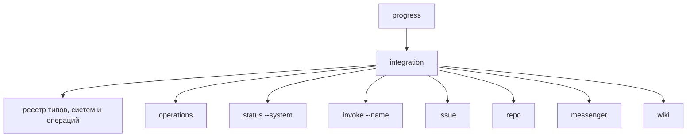

# CLI контура интеграции

## 1. Назначение документа

Настоящий документ определяет практический срез контура интеграции с внешними системами. Контур поддерживает GitHub как трекер и репозиторий, Bitbucket как репозиторий, Mattermost и Telegram как мессенджеры, Confluence как тип интеграции `wiki`.

Документ фиксирует:

- модель работы интеграционного слоя;
- границы ответственности между CLI, сервисом интеграции, `gh` и HTTP API внешних систем;
- состав пользовательских команд;
- порядок настройки встроенных адаптеров.

## 2. Принцип встроенных интеграций

GitHub-адаптер поддерживает два способа обращения к внешней системе: режим `cli` через `gh` и режим `api` через GitHub REST API и GraphQL API. Если способ не указан, сохраняется совместимый режим `cli`. Bitbucket, Mattermost, Telegram и Confluence используют HTTP API и нормализуют ответы в те же канонические структуры.

Базовая схема вызова:

1. CLI принимает входной запрос пользователя или другого контура;
2. сервис интеграции формирует внутренний `IntegrationRequest`;
3. реестр выбирает адаптер по типу интеграции и имени системы;
4. адаптер выполняет вызов `gh` или HTTP API;
5. адаптер считывает структурированный ответ;
6. JSON-ответ преобразуется во внутреннюю нормализованную структуру;
7. CLI печатает результат в диагностическом или структурированном виде.


## 3. Режимы GitHub-адаптера

Режим `cli` запускает `gh` как внешний инструмент. На первом этапе такой подход был предпочтителен по следующим причинам:

- для GitHub не требуется отдельно реализовывать OAuth, PAT и хранение приватных значений;
- можно опереться на уже существующую авторизацию пользователя в `gh auth login`;
- `gh` уже покрывает типовые GitHub-сущности: `issue`, `pull request`, `comments`, `search`, `repo`, `api`;
- интеграция может начать работать как тонкий адаптер без преждевременного усложнения кодовой базы.

Ограничения такого подхода:

- требуется установленный бинарь `gh`;
- часть ошибок приходит как текст из `stderr` и должна быть нормализована;
- доступные операции ограничены возможностями установленной версии `gh`.

Режим `api` выполняет прямые HTTP-вызовы к GitHub REST API и GraphQL API. Он использует `token`, `token_env`, `token_private` или данные GitHub App из описания системы, по умолчанию обращается к `https://api.github.com`, а для GitHub Enterprise Server может получать базовый адрес через `base_url`. CLI-команды контура при этом не меняются: наружу возвращаются те же канонические объекты `Response`, `CanonicalTask`, `Repository`, `MergeRequest`, `ReviewRemark`, `OperationResult` и `Failure`.

### 3.1 Авторизация GitHub App

В режиме `api` GitHub-адаптер может работать через установку GitHub App. В этом случае в настройке интегрируемой системы задаются данные приложения и установки, а контур интеграции выпускает установочный токен внутри процесса.

Минимальная настройка:

```json
{
  "default_systems": {
    "issue": "github-app",
    "repo": "github-app"
  },
  "systems": {
    "github-app": {
      "type": "github",
      "transport": "api",
      "default_repo": "rasungatullin/progress",
      "github_app_id": "12345",
      "github_app_installation_id": "144549701",
      "github_app_private_key_path": "~/.progress/integration_data/progress-synthesis.2026-07-05.private-key.pem"
    }
  }
}
```

Вместо `github_app_id` можно задать `github_app_client_id`; если заполнены оба поля, для `iss` JWT используется `github_app_id`. PEM-ключ можно передать через `github_app_private_key_private`; тогда значение читается из выбранного хранилища приватных значений и не записывается в проектную конфигурацию.

Дополнительное поле `github_app_token_refresh_before` задаёт упреждающее обновление установочного токена. Если поле не задано, применяется запас `5m`. Значение должно быть положительной длительностью Go, например `10m`.

Порядок работы:

1. адаптер формирует JWT приложения с `iat`, `exp`, `iss` и подписью `RS256`;
2. выполняет `POST /app/installations/{github_app_installation_id}/access_tokens`;
3. сохраняет установочный токен только в памяти процесса;
4. использует его как bearer-токен для REST API и GraphQL API;
5. переиздаёт токен до `expires_at` с заданным запасом.

JWT, установочный токен и содержимое PEM не включаются в CLI-вывод, структурированный вывод, журналы или `CommandResult.Stdout`. Для живой проверки после заполнения `github_app_id` или `github_app_client_id` можно выполнить:

```bash
progress integration status --system github-app --format json
progress integration repo get --system github-app --repo rasungatullin/progress --format json
```

## 4. Внутренние модули реализации

Минимальный состав кода для первого этапа:

- `internal/integration/service.go` — фасад контура интеграции;
- `internal/integration/model/types.go` — типы запросов и нормализованных ответов;
- `internal/integration/github/service.go` — адаптер GitHub;
- `internal/integration/github/runner.go` — безопасный запуск `gh`;
- `internal/integration/github/api_runner.go` — прямой вызов GitHub REST API и GraphQL API;
- `internal/integration/bitbucket/service.go` — адаптер Bitbucket;
- `internal/integration/mattermost/service.go` — адаптер Mattermost;
- `internal/integration/telegram/service.go` — адаптер Telegram;
- `internal/integration/confluence/service.go` — адаптер Confluence;
- `internal/cli/integration.go` — ветка CLI-команд `progress integration ...`.

Минимальные внутренние интерфейсы:

```go
type Query struct {
    System string
    Kind   string
    Repo   string
    ID     string
    Search string
}

type Provider interface {
    Execute(context.Context, Query) (Result, error)
}
```

Реестр выбирает `Provider` по имени интегрируемой системы. Если имя системы не указано, используется `default_systems` для типа интеграции.

## 5. Нормализованные сущности

Чтобы не распространять специфику внешних систем по другим контурам, вводятся канонические сущности:

- `CanonicalTask`;
- `TaskComment`;
- `Repository`;
- `MergeRequest`;
- `ReviewRemark`;
- `MessageThread`;
- `Message`;
- `MessageReaction`;
- `WikiPage`;
- `Failure`;
- `OperationResult`.

Для перехода соседних контуров сохраняется заполнение прежних структур, когда результат может быть однозначно преобразован:

- `TrackerIssue`;
- `TrackerPullRequest`;
- `TrackerComment`;
- `TrackerReview`;
- `TrackerRepository`;
- `TrackerUser`;
- `TrackerSearchResult`.

Минимальные поля `TrackerIssue`:

- `System`;
- `Repository`;
- `ID`;
- `Title`;
- `Body`;
- `State`;
- `Labels`;
- `Assignees`;
- `Author`;
- `URL`;
- `CreatedAt`;
- `UpdatedAt`.

Минимальные поля `TrackerPullRequest`:

- `System`;
- `Repository`;
- `Number`;
- `Title`;
- `Body`;
- `State`;
- `Author`;
- `ReviewDecision`;
- `BaseRef`;
- `HeadRef`;
- `Labels`;
- `URL`;
- `CreatedAt`;
- `UpdatedAt`.

## 6. Состав CLI-команд

Публичное дерево использует предметные типы и служебные команды. Система
выбирается флагом `--system` либо настройкой `default_systems`.

- `progress integration operations`;
- `progress integration status --system github`;
- `progress integration invoke --name issue.issue.get --input '{"id":"123"}'`;
- `progress integration issue get --id 123`;
- `progress integration issue search --query "текст"`;
- `progress integration issue create`, `issue update`, `issue comment list`, `issue comment create`, `issue label add`, `issue label remove`;
- `progress integration repo get`;
- `progress integration repo merge-request get`, `search`, `create`;
- `progress integration repo merge-request comment list`, `create`;
- `progress integration repo merge-request review-remark list`, `create`, `reply`, `resolve`, `unresolve`;
- `progress integration messenger thread get` и `messenger message create`;
- `progress integration wiki page get` и `wiki page search`.

## 7. Назначение команд

### 7.0 Типо-ориентированные команды

Новые команды выбирают предметный тип объекта, а не название внешней системы:

```text
progress integration issue get --id ABC-123
progress integration issue search --query "готово к реализации" --system jira-main
```

Флаг `--id` принимает непрозрачную строку: как числовое значение `123`, так и значение внешней системы `ABC-123`. Если `--system` не задан, контур выбирает систему по умолчанию для типа `issue`; явное значение выбирается по имени записи в конфигурации. Команды по именам внешних систем отсутствуют в публичной справке.

### 7.1 `progress integration operations`

Команда публикует каталог интеграционных операций, доступных по текущей конфигурации систем. Каталог нужен контуру исполнения и диагностическим проверкам: он показывает каноническое имя операции, интегрируемую систему, тип адаптера, контракт входных полей, тип результата, признак побочного действия и возможные отказные состояния.

Базовые вызовы:

```bash
progress integration operations
progress integration operations --format json
progress integration operations --type issue
progress integration operations --system github
progress integration operations --name issue.issue.get
```

Каноническое имя операции строится по схеме:

```text
<тип-интеграции>.<объект>.<операция>
```

Примеры:

- `issue.issue.get`;
- `issue.issue.comment.create`;
- `repo.merge-request.create`;
- `repo.comment.reply`;
- `repo.comment.resolve`;
- `messenger.message.create`;
- `wiki.page.search`.

Текстовый вывод предназначен для ручной диагностики. JSON-вывод возвращает массив `OperationDescriptor` и пригоден для машинного чтения.

Отключённая система может присутствовать в каталоге только с `available=false`. Сценарные системы типа `script` публикуют операции из `systems.<name>.operations`; доступными считаются только операции с заданным `script`, `command` или `path`. Контракт входных полей сохраняется из конфигурации.

Хранилище приватных значений не входит в публичное пространство имён интеграции и настраивается только через контур настроек и ресурсов.

### 7.4 Предметные команды

Все предметные команды поддерживают общий флаг `--format text|json` и выбор системы через `--system` либо `default_systems`. Команды по именам внешних систем в публичный контракт не входят.

Примеры вызовов:

```bash
progress integration issue get --id ABC-123 --fields title --format json
progress integration issue search --query "готово" --labels backend --exclude_labels blocked
progress integration issue create --title "Новая задача" --external_id EXT-123
progress integration issue comment list --id ABC-123
progress integration issue label add --id ABC-123 --labels backend
progress integration repo merge-request get --repo owner/name --number 456
progress integration repo merge-request comment list --repo owner/name --number 456
progress integration repo merge-request review-remark create --repo owner/name --number 456 --path internal/service.go --line 42 --body "Проверить обработку"
progress integration messenger thread get --thread THREAD-1 --system mattermost
progress integration messenger message create --channel CHANNEL-1 --thread THREAD-1 --text "Состояние обновлено"
progress integration wiki page get --id 12345 --system confluence
progress integration wiki page search --query "интеграция"
```

Обычный комментарий запроса на слияние и замечание ревизии являются разными командами. Координаты `--path`, `--line` и `--side` доступны только для создания замечания ревизии. Для диагностического вызова `invoke` вход проверяется по `OperationInputContract`, а выполнение проходит через тот же `Service.Execute`, что и предметные команды.

## 8. Схема дерева команд



## 9. Общие флаги и правила вызова

Для унификации вызовов целесообразно ввести общие флаги:

- `--repo` — репозиторий `owner/name`;
- `--number` — номер запроса на слияние;
- `--labels` — метки задачи;
- `--exclude_labels` — метки, исключаемые из поиска;
- `--id` — внешний идентификатор объекта, если источник не использует числовой номер;
- `--query` — поисковая строка;
- `--limit` — ограничение числа результатов;
- `--format` — `text` или `json`;

Базовые правила:

1. если операция требует репозиторий, `--repo` обязателен; при его отсутствии адаптер может использовать `default_repo` выбранной системы;
2. если операция адресует запрос на слияние по номеру, `--number` обязателен;
3. если операция ищет задачи по меткам, используются имена полей каталога `--labels` и `--exclude_labels`;
4. если операция адресует страницу документации, `--id` содержит внешний идентификатор страницы;
5. для машинного использования предпочтителен `--format json`;
6. текстовый вывод нужен для ручной диагностики и первичного освоения CLI.

## 10. Обработка ошибок

GitHub-адаптер должен различать как минимум следующие классы ошибок:

- `gh` не установлен;
- `gh` не авторизован;
- токен API не задан или отклонён внешней системой;
- репозиторий не найден;
- issue или PR не найден;
- доступ запрещён;
- превышен rate limit;
- формат ответа неожиданно изменился;
- внешний вызов завершился по таймауту.

Для других контуров ошибка должна возвращаться не как сырая строка `stderr`, а как структурированное состояние с признаком:

- `temporary-unavailable`;
- `auth-required`;
- `permission-denied`;
- `not-found`;
- `invalid-request`;
- `unsupported-operation`;
- `internal-integration-error`.

## 11. Конфигурация

Контур интеграции использует двухслойную конфигурацию систем:

1. глобальный слой `$PROGRESS_CONFIG_HOME/integration/systems.json` или `~/.config/progress/integration/systems.json`;
2. локальный слой `.progress/integration/systems.json`.

Локальный слой имеет приоритет над глобальным:

1. `default_system` полностью заменяет глобальное значение;
2. `default_systems.<type>` заменяет систему по умолчанию для конкретного типа интеграции;
3. `private_store` задаёт реализацию хранилища приватных значений и сливается по простым полям;
4. `systems.<name>` дополняет или переопределяет одноимённую систему из глобального слоя;
5. простые поля системы, например `transport`, `command`, `path`, `timeout`, `base_url`, `token_private`, `token_env`, `github_app_id`, `github_app_client_id`, `github_app_installation_id`, `github_app_private_key_path`, `github_app_private_key_private`, `github_app_token_refresh_before`, `repository`, `project`, `channel_id`, `chat_id` и `default_repo`, заменяются локальными значениями;
6. `database` дополняется по полям `driver`, `path` и `dsn`;
7. `settings` сливается по имени настройки;
8. `task_label_mapping` сливается по внешней метке;
9. `operations` сливается по ключу операции;
10. `enabled=false` в локальном слое выключает систему целиком.

Минимальная конфигурация встроенных адаптеров может выглядеть так:

```json
{
  "private_store": {
    "type": "keychain",
    "service": "progress"
  },
  "default_systems": {
    "issue": "github",
    "repo": "github",
    "messenger": "mattermost",
    "wiki": "confluence"
  },
  "systems": {
    "github": {
      "type": "github",
      "integration_types": ["issue", "repo"],
      "enabled": true,
      "transport": "cli",
      "command": "gh",
      "timeout": "30s",
      "repository": "owner/name",
      "default_repo": "owner/name",
      "task_label_mapping": {
        "bug": "bug",
        "type:backend": "backend",
        "external-only": ""
      }
    },
    "bitbucket": {
      "type": "bitbucket",
      "integration_type": "repo",
      "enabled": true,
      "base_url": "https://api.bitbucket.org/2.0",
      "api_variant": "cloud",
      "token_env": "BITBUCKET_TOKEN",
      "workspace": "workspace",
      "repository": "workspace/repository"
    },
    "mattermost": {
      "type": "mattermost",
      "integration_type": "messenger",
      "enabled": true,
      "base_url": "https://mattermost.example",
      "token_private": "mt_auth_token",
      "channel_id": "channel-id"
    },
    "telegram": {
      "type": "telegram",
      "integration_type": "messenger",
      "enabled": true,
      "token_env": "TELEGRAM_BOT_TOKEN",
      "chat_id": "chat-id"
    },
    "confluence": {
      "type": "confluence",
      "integration_type": "wiki",
      "enabled": true,
      "base_url": "https://confluence.example/confluence",
      "username": "service-user",
      "token_env": "CONFLUENCE_TOKEN"
    },
    "local": {
      "type": "local-tracker",
      "integration_type": "issue",
      "enabled": true,
      "database": {
        "driver": "sqlite",
        "path": ".progress/local-tracker/tasks.sqlite"
      }
    },
    "work-tracker": {
      "type": "script",
      "integration_type": "issue",
      "enabled": true,
      "timeout": "30s",
      "project": "ABC",
      "settings": {
        "tracker_url": "https://tracker.example"
      },
      "operations": {
        "issue.issue.get": {
          "script": ".progress/integration/work-tracker/task-get.sh",
          "required": ["id"],
          "optional": ["project", "tracker_url"],
          "defaults": {
            "project": "${system.project}",
            "tracker_url": "${system.settings.tracker_url}"
          }
        },
        "issue.issue.comment.create": {
          "script": ".progress/integration/work-tracker/task-comment-create.sh",
          "required": ["id", "body"]
        }
      }
    }
  }
}
```

Назначение общих полей системы:

1. `type` фиксирует тип встроенного адаптера: `github`, `bitbucket`, `mattermost`, `telegram`, `confluence`, `local-tracker` или `script`;
2. `integration_type` задаёт один тип интеграции, а `integration_types` — несколько типов для одной системы;
3. `enabled` включает или выключает систему без удаления её описания;
4. `default=true` делает систему системой по умолчанию для её типов, если `default_systems` не задаёт явное значение;
5. `command` и `path` позволяют переопределить исполняемый файл `gh`;
6. `timeout` ограничивает внешний вызов;
7. `transport` для GitHub выбирает способ обращения: `cli` через `gh` или `api` через GitHub REST API и GraphQL API; если поле не задано, используется `cli`;
8. `base_url` задаёт базовый адрес HTTP API для GitHub в режиме `api`, Bitbucket, Mattermost, Telegram или Confluence;
9. `api_variant` задаёт вариант Bitbucket API: `cloud` для `api.bitbucket.org/2.0` или `server` для Bitbucket Server/Data Center через `rest/api/1.0`;
10. `token`, `token_private` или `token_env` задают данные авторизации, ссылку на приватное значение или ссылку на переменную окружения;
11. `repository` задаёт резервный репозиторий для репозиторных операций;
12. `workspace` задаёт рабочее пространство Bitbucket Cloud, если `--repo` передан без префикса;
13. `project` задаёт ключ проекта Bitbucket Server/Data Center, если `--repo` передан без префикса;
14. `channel_id` задаёт резервный канал Mattermost;
15. `chat_id` задаёт резервный чат Telegram;
16. `database` задаёт хранилище локального трекера; в текущем срезе поддержан `driver=sqlite`;
17. `settings` задаёт несекретные настройки сценарных систем и других расширяемых адаптеров;
18. `task_label_mapping` задаёт сопоставление меток задачи: внешняя метка в ключе, каноническое название в значении, пустое значение для игнорирования внешней метки;
19. `operations` задаёт пооперационную настройку сценариев и их входных контрактов.

Поле `Extra` внутренней модели запроса не является отдельным флагом CLI. Оно передаёт в сценарий дополнительные поля, прошедшие проверку входного контракта операции, без изменения имён и значений. Поле не предназначено для секретов и не заменяет типизированные поля встроенных операций.

При чтении прежних установок сохраняется совместимость с `github.json`: его значения преобразуются в текущую конфигурацию интеграционных систем. Для токенов применяется следующий порядок: явно заданный `token`, затем значение из `token_private`, затем переменная из `token_env`; приватные значения читаются через `private_store` и не выводятся в диагностике. `default_repo` используется только выбранным адаптером, если репозиторий не передан явно через `--repo`.

Пример GitHub-системы в режиме `api`:

```json
{
  "systems": {
    "github": {
      "type": "github",
    "integration_types": ["issue", "repo"],
      "enabled": true,
      "transport": "api",
      "base_url": "https://api.github.com",
      "token_env": "GITHUB_TOKEN",
      "repository": "owner/name",
      "timeout": "30s"
    }
  }
}
```

Если `base_url` не задан для GitHub в режиме `api`, используется `https://api.github.com`. Для локально размещённого GitHub Enterprise Server указывается базовый адрес REST API, например `https://github.example/api/v3`; GraphQL-вызовы будут направлены в соответствующий путь `/api/graphql`.

### 11.1 Локальный трекер задач

Система `type=local-tracker` подключает локальное хранилище задач как обычную интегрируемую систему типа `tracker`. Если `database` не задан, используется SQLite-файл `.progress/local-tracker/tasks.sqlite` относительно корня репозитория.

Минимальная настройка:

```json
{
  "default_systems": {
    "issue": "local"
  },
  "systems": {
    "local": {
      "type": "local-tracker",
      "integration_type": "issue",
      "enabled": true
    }
  }
}
```

Локальный трекер поддерживает операции:

- `issue.issue.create`;
- `issue.issue.get`;
- `issue.issue.search`;
- `issue.issue.update`;
- `issue.issue.comment.list`;
- `issue.issue.comment.create`;
- `issue.issue.label.add`;
- `issue.issue.label.remove`.

Хранилище создаёт схему при первом обращении. Задачи и комментарии возвращаются как `CanonicalTask`, `TaskComment`, `OperationResult` и совместимые структуры `TrackerIssue`/`TrackerComment`.

### 11.2 Сценарная система `script`

Система `type=script` позволяет подключить внешний трекер или служебную систему через локальный исполняемый файл. Сценарий выбирается по каноническому имени операции из `operations`.

Перед запуском адаптер:

1. выбирает операцию по `IntegrationType`, `ObjectType` и `Operation`;
2. применяет значения по умолчанию из `defaults`;
3. проверяет обязательные поля `required`;
4. записывает входной JSON во временный файл;
5. запускает сценарий из корня репозитория или из директории `path`, если она задана;
6. читает JSON-ответ из stdout и нормализует его в `Response`.

Сценарий получает переменные окружения:

```text
PROGRESS_INTEGRATION_SYSTEM
PROGRESS_INTEGRATION_TYPE
PROGRESS_INTEGRATION_OPERATION
PROGRESS_INTEGRATION_REQUEST_FILE
PROGRESS_INTEGRATION_TIMEOUT
```

Файл `PROGRESS_INTEGRATION_REQUEST_FILE` содержит `system`, `integration_type`, `operation_name`, `object_type`, `operation`, `request` и `settings`. Для `issue.issue.search` поле `request` может содержать `query`, `state`, `labels`, `exclude_labels` и `limit`. Поле `settings` содержит только явно настроенные несекретные значения. `token` и значение из `token_env` в JSON-файл не записываются.

Успешный ответ сценария:

```json
{
  "status": "ok",
  "task": {
    "system": "work-tracker",
    "number": 123,
    "title": "Задача",
    "body": "Описание",
    "state": "open",
    "traits": ["backend"]
  }
}
```

Ответ операции изменения:

```json
{
  "status": "ok",
  "operation_result": {
    "status": "ok",
    "message": "Комментарий создан",
    "url": "https://tracker.example/task/ABC-123#comment-1"
  }
}
```

Отказ сценария:

```json
{
  "status": "failed",
  "failure": {
    "kind": "not-found",
    "message": "Задача не найдена"
  }
}
```

Ошибки запуска, ненулевой код выхода, таймаут, невалидный JSON и неподдержанная операция переводятся в канонические отказные состояния контура интеграции.

Настройка `private_store` выбирает реализацию хранилища приватных значений. Если `type` не задан, на macOS в сборке с `cgo` используется `keychain` с сервисом `progress`. В остальных средах используется файловая реализация `file` в `$PROGRESS_CONFIG_HOME/integration/private-values.json` или `~/.config/progress/integration/private-values.json` с правами доступа `0600`. Явный `keychain` отклоняется при запуске сборки, где macOS Keychain недоступен.
